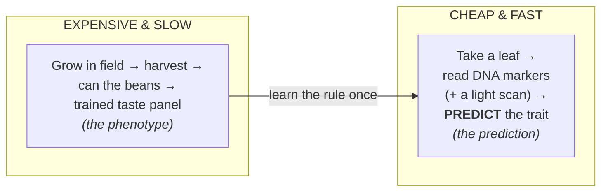
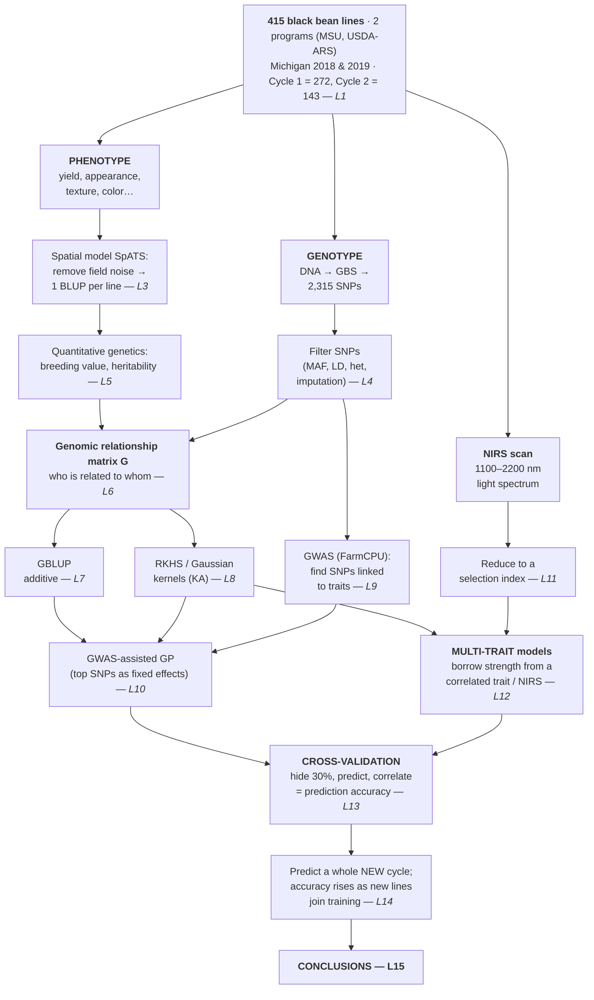

# Lesson 0 — The Mental Map

> **Goal of this lesson:** before any equations, get the *whole study* into your head as a
> single picture. Everything else in the course is a zoom-in on one box of this map.

---

## 0.1 The one-sentence research question

> **Can we use a plant's DNA (and cheap light-scan data) to predict how good its beans will
> be — for *yield* and for *canning quality* — accurately enough to pick winners *before*
> we grow and taste them?**

That's it. If we can predict well from DNA, a breeder can **select** the best lines using
only a leaf sample, skipping years of field trials and expensive taste panels. Faster
selection = faster **genetic gain** = better cultivars sooner.

---

## 0.2 Why this question is *hard* (and therefore interesting)

Three honest difficulties, which the whole study is designed around:

1. **The two goals fight each other.** High **seed yield** and high **canning quality**
   tend to be *negatively* associated in beans. Selecting hard for one can drag the other
   down. (We'll confirm this in the real data: yield ↔ seed-weight is positive, but
   seed-weight ↔ texture is *negative*.)
2. **Quality is painful to measure.** Canning appearance and texture need special
   equipment and a *trained human taste/look panel* — slow, costly, low-throughput. Most
   breeding programs simply can't measure it on thousands of lines.
3. **These are *complex* (polygenic) traits.** Yield and appearance are controlled by
   *many* genes of small effect, not one or two. So you can't just find "the yield gene"
   and select on it.

These three facts explain *every* method choice in the paper. Keep them in mind.

---

## 0.3 The big idea: prediction instead of measurement

We measure *both* DNA and phenotype on a **training set** of lines, learn the statistical
relationship, then for **new** lines we measure *only* DNA and **predict** the phenotype.
This is **genomic prediction (GP)**; using those predictions to choose parents/lines is
**genomic selection (GS)**.

---

## 0.4 The whole study as one flowchart

Read this top to bottom. Each box is (roughly) one lesson.

---

## 0.5 The four objectives (the study's own words, decoded)

The paper states four objectives. Here they are in plain language, mapped to lessons:

| # | Paper's objective | In plain words | Lessons |
|---|-------------------|----------------|---------|
| 1 | Compare **single-trait (ST)** vs **multi-trait (MT)** GP for yield & quality | Is it better to predict each trait alone, or to let correlated traits help each other? | 7, 12, 13 |
| 2 | Assess **NIRS-based selection indices** as secondary traits in MT models | Can a cheap light scan stand in as a helpful extra trait? | 11, 12 |
| 3 | Assess adding **GWAS-significant SNPs** to GP models | Does telling the model "these specific SNPs matter" help? | 9, 10 |
| 4 | Measure how many **new-cycle genotypes** you must add to keep predicting well | How often, and how much, must you refresh the training set? | 14 |

> **The punchlines (so you know where we're heading):**
> - MT models **did not** beat ST *within* a cycle, but **did** beat ST *across* cycles
>   (up to **+63% for yield**, **+41% for appearance**). → *Correlated traits help most when
>   prediction is otherwise hard.*
> - Adding NIRS or GWAS SNPs **did not** help (often slightly *hurt*). → *More information is
>   not automatically better.*
> - Accuracy **rose** as lines from the new cycle were added to training. → *Keep your
>   training set fresh.*

---

## 0.6 The mental model to carry through the whole course

Hold these three layers in your head; every lesson slots into one:

1. **Biology layer** — genes → traits, in a real crop with real field noise. (L1, L3–L5)
2. **Relationship layer** — DNA tells us *who resembles whom* (matrix **G**) and *which
   loci matter* (GWAS). (L4, L6, L9)
3. **Prediction layer** — a statistical model uses the relationship layer to guess
   phenotypes for unseen lines, and we *honestly* score it. (L7–L8, L10–L14)

When you feel lost later, ask: *"Which layer am I in, and which flowchart box?"*

👉 Next: **[Lesson 1 — Beans, Breeding & the Traits](01_biology_and_breeding.md).**
