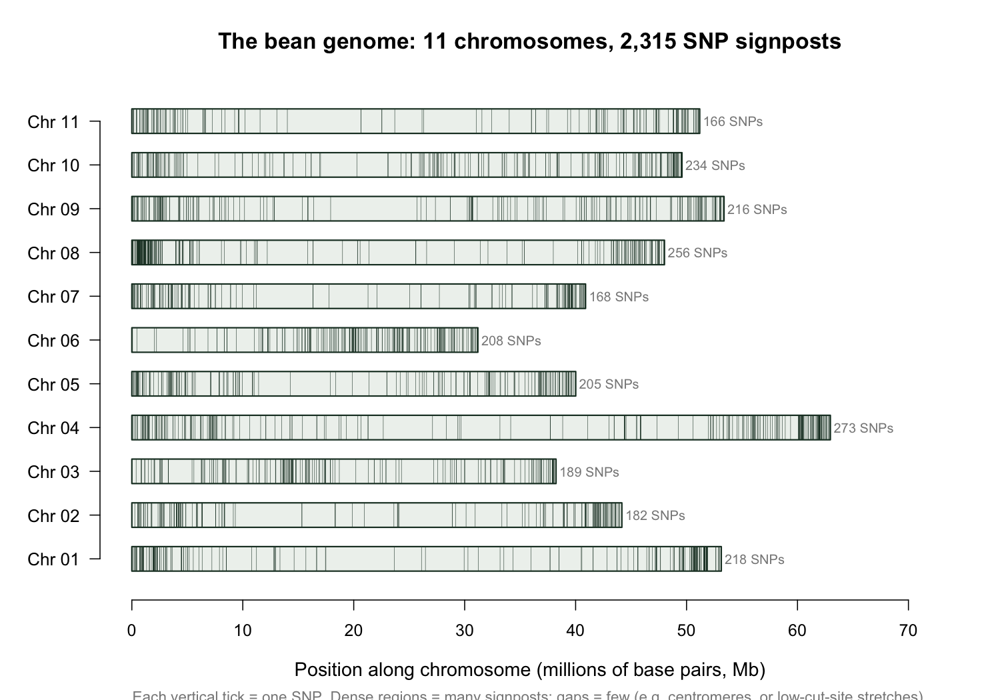
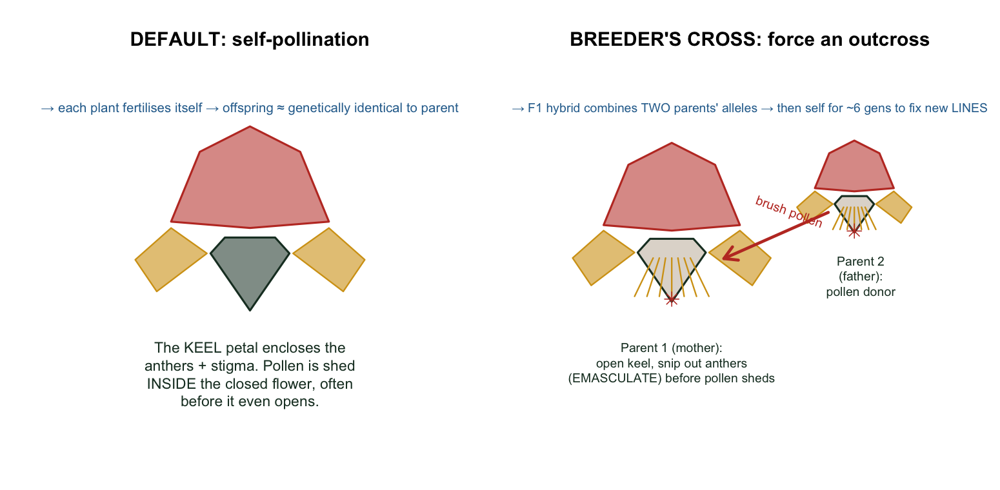
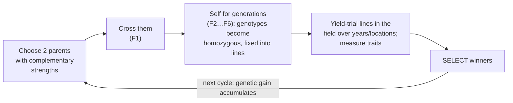
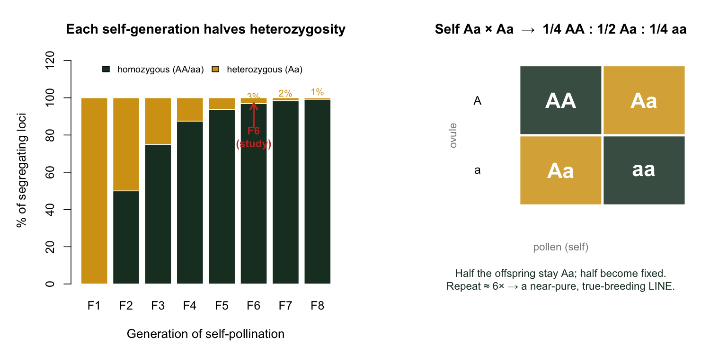
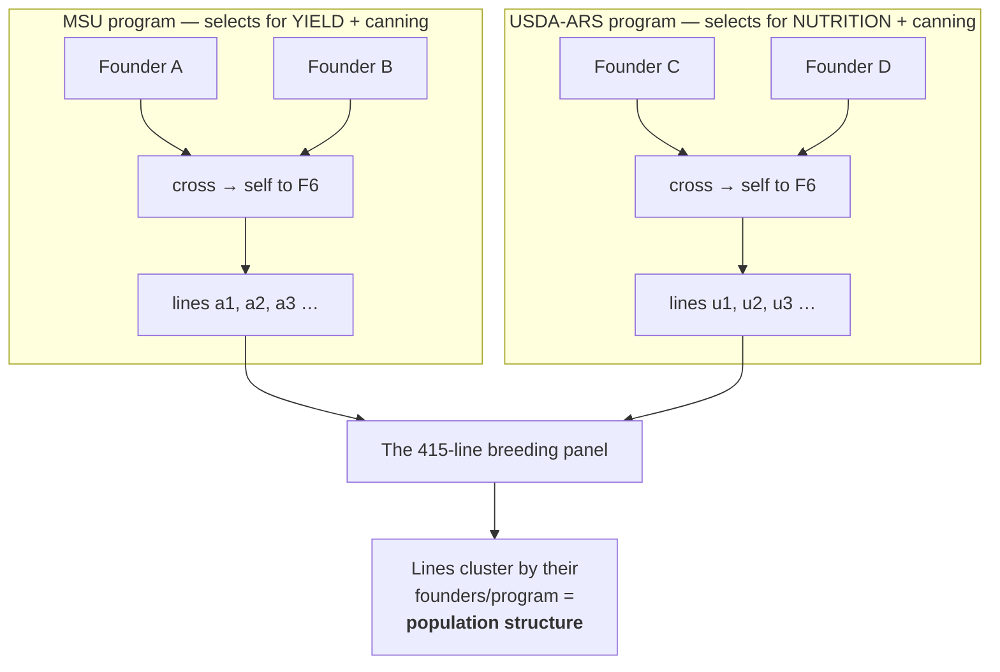
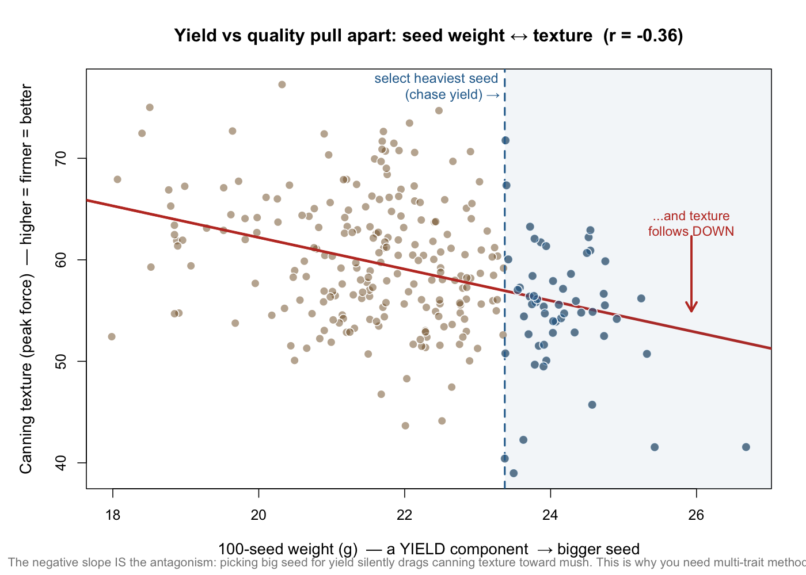

# Lesson 1 — Beans, Breeding & the Traits

> **The question:** *What* are we breeding, *which* traits matter, and *why* do they fight
> each other? Without this, the statistics later will feel arbitrary.

---

## 1.1 The crop: *Phaseolus vulgaris*, the common bean

- **Common bean** (*Phaseolus vulgaris* L.) is the most important grain legume for direct
  human consumption worldwide — a cheap, storable source of **protein, fiber, iron and
  zinc**.
- It comes in **market classes** defined by seed color/shape: navy, pinto, kidney,
  great northern… and **black bean**, the focus of this study. Black beans are popular and
  *rising* in the U.S.
- Genetically, common bean is **diploid** with **2n = 22** → **11 chromosomes**. Picture the
  genome as **11 long strings**; the 2,315 SNPs we genotype are **signposts scattered along
  them** (this exact map, from the study's own data, is below). (Remember this number: SNPs fall
  on chromosomes 01–11. We confirmed exactly 11 in the data.)

> 🔬 **This is the real map** (`code/08_biology_figures.R`, from `GB_BLB$SNP_Position`). Each tick
> is one of the 2,315 SNPs. Notice they are **unevenly spaced** — dense clusters and bare gaps.
> That patchiness comes straight from *how* we genotype (Lesson 4: we only read DNA near
> restriction-enzyme cut-sites), and it's *why* a SNP is a **signpost near** a gene, not the gene
> itself.

- It is largely **self-pollinating** — and the *reason* is anatomical. A bean flower's lower petals
  fuse into a **keel** that completely **encloses the anthers (pollen) and stigma (egg-receiver)**.
  Pollen is shed *inside that closed keel*, often **before the flower even opens**, so a bean
  normally **fertilises itself**.

🌱 **Breeding logic — two consequences of selfing.**
1. **Lines breed true.** Self-fertilisation drives a plant toward **homozygosity** (next section):
   after a few generations its two gene copies match at nearly every locus, so its offspring are
   ~genetically identical to it. A **line** is therefore a *reproducible genotype* — you can grow
   the *same* genetic individual across years and locations, which is *why* "the breeding value of
   line X" is a stable thing worth predicting.
2. **Crossing takes deliberate work.** To combine two parents (right panel) a breeder must
   physically **open the keel and snip out the anthers (emasculate)** before they shed, then **brush
   on pollen from a chosen donor**. Nature won't outcross beans for you — every new combination is a
   hand-made cross.

---

## 1.2 How a bean cultivar gets made (the breeding cycle)

A simplified dry-bean breeding cycle:

### How a *line* actually gets fixed (the "self for generations" step)

The vague phrase "self for generations" hides the single most important genetic event in bean
breeding. Start from an **F1 hybrid** (one copy of each parent's chromosomes → heterozygous `Aa`
at every locus where the parents differed). Each round of self-pollination is an `Aa × Aa` mating,
which by Mendel gives **¼ AA : ½ Aa : ¼ aa** — so **half of the still-mixed loci become fixed**
every generation:

🧠 **Read the left bars.** Heterozygosity **halves** each generation: 100% → 50% → 25% → … By
**F6** (where this study's lines sit) only ~3% of loci are still segregating — the line is
**essentially a fixed, true-breeding genotype**. *That* is what makes it safe to call line X "one
genotype" and test it in many plots. (`code/08_biology_figures.R`.)

### Different founders → different lines → population structure

A breeder doesn't make *one* cross — they make **many crosses from different pairs of founder
parents**, and each cross, after selfing, throws off a **family of distinct fixed lines**. The 415
lines here come from **two programs that started from different founders and selected for different
goals**:

🧠 **Why this matters later.** Lines that share founders share long chromosome stretches, so the
panel is **not** 415 unrelated individuals — it's **clumps of relatives**. That relatedness is the
very thing genomic prediction *exploits* (Lessons 6–7), but it's also what *confounds* GWAS
(Lesson 9) and shows up as the clusters in the relationship matrix (Lesson 6) and PCA
(`figures/04_pca_structure.png`).

In this study the lines are at the **F6 generation or later** — i.e. essentially fixed,
homozygous lines ready for yield testing. They come from **two programs**:

| Program | Emphasis |
|---------|----------|
| **MSU** (Michigan State University) | seed **yield** and canning quality |
| **USDA-ARS** | **nutritional** and canning quality |

Because the two programs select for *different* things from *different* parents, their lines
form somewhat **distinct genetic groups** — this is **population structure**, and it will
come back to bite us in GWAS (Lesson 9) and is visible in the relationship matrix (Lesson 6).

### Breeding *cycles* in this dataset (memorize this — it structures everything)
- **Cycle 1 = 272 lines.** Advanced/preliminary trial lines, grown in **both 2018 and 2019**.
- **Cycle 2 = 143 lines.** A *newer* set, grown **only in 2019**.
- Total = **415 lines** (rows of every data matrix you'll meet).

> 🔬 **In the data.** We confirmed it directly:
> rows 1–272 have a 2018 yield value (272 of them); rows 273–415 do **not** (0), but 142 of
> them have a 2019 yield value. So the row order *encodes* the cycle. This single fact is
> what makes Objective 4 ("predict the new cycle") possible.

🧠 **Intuition — why "cycle" matters for prediction.** Cycle 2 is the *future* relative to
cycle 1. If we train a model on cycle 1 and predict cycle 2, we are simulating exactly what
a breeder does: *use last year's data to pick this year's winners.* Lesson 14 is entirely
about this.

---

## 1.3 The traits — and the words breeders actually use

The study measures **agronomic** traits and **canning-quality** traits. You don't need to
memorize all of them, but you must understand the two *stars* (yield & appearance) and why
the *supporting cast* (seed weight, texture) matters.

### Agronomic traits (measured in the field)
| Code | Trait | What it is | Why measured |
|------|-------|-----------|--------------|
| **YD** | Seed yield (kg/ha) | total seed weight per area, at 18% moisture | the #1 breeding target |
| **SW** | 100-seed weight (g) | weight of 100 seeds | a yield *component*, easy & fast to measure |
| **DF** | Days to flowering | days from planting to 50% plants flowering | maturity/adaptation |
| **DPM** | Days to maturity | days until pods start drying | maturity/adaptation |

### Canning-quality traits (measured in the lab, after cooking)
Beans are cooked in a standardized **canning protocol** (soaked, blanched, brined, retorted),
then evaluated:

| Code | Trait | How measured | Scale |
|------|-------|--------------|-------|
| **App** | Canning **appearance** | a *trained human panel* (8–12 people) rates each sample | 1 (worst) – 5 (best) |
| **Col** | Color (darkness) | panel rating | 1 (lightest) – 5 (darkest) |
| **Text** | **Texture** | a machine (texture analyzer) measures peak force to compress 100 g | force (objective) |
| **L\*** | Lightness | Hunter colorimeter | 0 black → 100 white |
| **a\*** | green↔red | colorimeter | − green / + red |
| **b\*** | blue↔yellow | colorimeter | − blue / + yellow |

⚠️ **Common confusion.** *Appearance and color are NOT the same.* "App" is the panel's
holistic judgment of how good the canned beans *look* (intact, glossy, dark). "Col" and
"L\*a\*b\*" are specific measures of darkness/hue. For black beans, **staying dark after
canning** ("color retention") is prized — pale, faded beans look unappetizing.

🌱 **Breeding logic — human panel vs machine.** The panel ratings (App, Col) are
*subjective* and *expensive* (you must assemble and train people, then cook samples for
them). The colorimeter (L\*a\*b\*) and texture analyzer are *objective* and cheaper. A
recurring theme of the paper: **can a cheaper, objective measurement (or a DNA prediction,
or a light scan) stand in for the expensive panel?**

---

## 1.4 The central tension: yield vs. quality

This is the heart of *why* the study needed clever multi-trait methods.

🧠 **Intuition.** Imagine two dials: **YIELD** and **CANNING QUALITY**. In beans, turning up
one tends to turn down the other. A famous example: bigger/heavier seeds (high SW, which
helps yield) can be *softer* after canning (worse texture). So a breeder who blindly selects
for yield may accidentally ship beans that turn to mush in the can.

🔬 **In the data (2018 BLUPs, reproduced in `code/01_explore_data.R`):**

| Pair | Correlation *r* | Reading |
|------|------------------|---------|
| Yield ↔ 100-seed weight | **+0.41** | bigger seeds → more yield (makes sense) |
| Yield ↔ days to maturity | +0.43 | later-maturing lines yield more |
| **Seed weight ↔ texture** | **−0.36** | **bigger seeds → softer (lower-force) texture** ← the tension |
| Yield ↔ appearance | ≈ 0.00 | no simple field-yield/quality link |

> Figure: `figures/02_trait_correlations.png` (full correlation heatmap).

**See the tension as a picture** — every dot is a real bean line (`code/08_biology_figures.R`):

🧠 **Read it.** The cloud **slopes down**: heavier-seeded lines tend to have *lower* texture force
(softer, mushier after canning). Now watch a breeder make the classic mistake — select the
**heaviest-seeded 20%** to chase yield (blue, right of the dashed line). Their **average texture
drops** (red arrow): you bought yield and *silently sold* canning quality. The dots don't all obey
— antagonism is a *tendency*, not a law — but the pull is real and it costs you.

That **−0.36** is the antagonism in miniature: the very thing that boosts yield (seed size)
costs you canning texture. **Selecting for both at once requires a method that can hold two
traits in view simultaneously** — which is exactly the *multi-trait* and *selection index*
machinery in Lessons 11–12.

⚠️ **Common confusion — "correlation isn't always strong."** Note yield ↔ appearance was
~0. Trait antagonisms are *tendencies*, not laws, and they vary by year (2018 was wetter, so
correlations differed from 2019). The study measured them across **two seasons** precisely
because single-year correlations can mislead.

---

## 1.5 Heritability — the trait property that decides "is prediction even possible?"

We'll define heritability mathematically in Lesson 5, but plant the seed now:

🧠 **Intuition.** **Heritability ($h^2$)** answers: *of the differences we see between lines,
what fraction is due to their genes* (as opposed to weather, soil patch, measurement
error)? It runs from 0 (all noise) to 1 (all genetics).

- **Color** in this study is *highly* heritable → easy to predict from DNA (accuracies up to
  **0.93**).
- **Yield** and **appearance** are *lower* heritability → harder to predict (accuracies
  ~0.4–0.6).

🌱 **Breeding logic.** You can only predict from DNA the part of a trait that *is* genetic.
A trait that's 80% weather noise has little signal for the genome to grab. So **heritability
sets a ceiling on prediction accuracy.** Keep this rule of thumb: *higher $h^2$ → higher
achievable accuracy.* It explains almost every accuracy ranking in the results.

---

## 1.6 What you should now be able to say

- Black bean is a self-pollinating, diploid (2n=22, **11 chromosomes**) grain legume; lines
  are near-homozygous reproducible genotypes.
- The dataset = **415 lines** in **2 cycles** (272 + 143) from **2 programs**, grown in
  Michigan 2018–2019.
- The breeding targets are **yield** and **canning quality (appearance, color, texture)**;
  quality is **expensive and subjective** to measure.
- Yield and quality are **antagonistic** (we saw SW ↔ texture = −0.36), which *motivates*
  multi-trait methods.
- **Heritability** caps how well any trait can be predicted.

👉 Next: **[Lesson 2 — The Data: anatomy of `GB_BLB`](02_the_data.md)** — we open the actual
file and look at every object inside.
