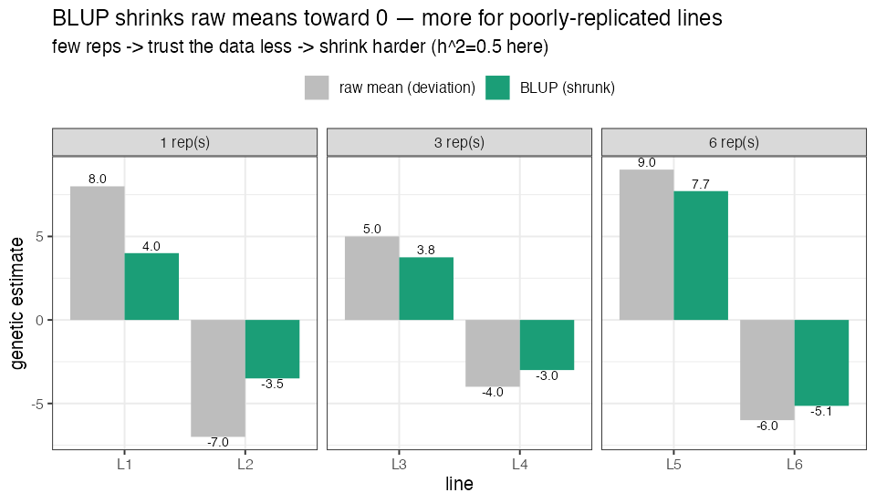

# Lesson 3 — Phenotyping & Spatial BLUPs

> **The question:** A field is not a spreadsheet. One corner is wetter, one edge gets more
> sun, a tractor compacted one strip. How do we turn *messy plot measurements* into **one
> fair number per line** that reflects its *genetics*, not its lucky/unlucky spot?
> Answer: a **mixed model** that produces a **BLUP**. This is repo script `0.Spatial_Analysis.r`.

---

## 3.1 Why raw plot values lie

Each line is grown in small **plots**, arranged in a grid of **rows (R)** and **columns/passes
(P)**. Two identical lines in two different plots can yield differently *purely because of where
they sat*. This spatial nuisance is **field heterogeneity**.

🧠 **Intuition.** If I judge students' "ability" by exam scores, but some students sat next to
a noisy window, I should *adjust* for the window before ranking them. The field's "windows"
are moisture gradients, fertility patches, edge effects. We want each line's score *after*
removing the seat it happened to get.

🌱 **Breeding logic.** Select on raw plot values and you'll sometimes promote a mediocre line
that sat in a fertile patch, and cull a great line stuck in a bad one. Spatial adjustment
protects genetic gain from being wasted on noise.

---

## 3.2 The experimental design (so the model has something to lean on)

- **2018:** an **incomplete block design**; 200 lines replicated twice, 72 lines (seed-limited)
  once.
- **2019:** a **complete block design**, 2 replications.
- Three **check** cultivars — **Eclipse, Zorro, Zenith** — are planted repeatedly throughout.
  Checks are *known* genotypes grown in many spots, so they act like **rulers**: by seeing how
  the *same* check varies across the field, the model learns the field's gradient.
- Plots are **4-row, 50-cm spacing, trimmed to 4.5 m**; the center 2 rows are harvested.

⚠️ **Common confusion — replication vs. checks.** *Replication* (growing a line more than once)
averages out noise for *that* line. *Checks* (a few genotypes grown many times everywhere) map
the *shape* of the field's gradient so it can be subtracted from *all* lines. You need both.

---

## 3.3 The model: a linear mixed model with a 2-D spatial surface

The authors use the R package **SpATS** (Spatial Analysis of field Trials with Splines). The
model for a trait $y$ measured on each plot is:

🧮 **The mixed model.**
$$
y_{ijk} \;=\; \underbrace{\mu}_{\text{overall mean}} \;+\; \underbrace{c_k}_{\text{check vs. non-check (fixed)}} \;+\; \underbrace{g_i}_{\text{genotype (random)}} \;+\; \underbrace{r_j + p_l}_{\text{row, column (random)}} \;+\; \underbrace{f(P,R)}_{\text{smooth 2-D field surface}} \;+\; \underbrace{e_{ijk}}_{\text{leftover error}}
$$

Term by term, in plain words:
- $\mu$ — the grand average of the trait.
- $c_k$ — a **fixed effect** distinguishing the check cultivars from the breeding lines.
- $g_i$ — the **genotype effect**: *this is the thing we want* — line $i$'s genetic deviation
  from the mean. Fitted as **random** (see box below).
- $r_j, p_l$ — random row and column effects (discrete field structure).
- $f(P,R)$ — a **smooth 2-D spline surface** over the field (the PSANOVA term). Think of
  draping a flexible sheet over the field to capture the gradual fertility/moisture trend.
- $e_{ijk}$ — what's left: pure noise.

In the actual SpATS call (from the repo):

```r
fit.yd18 <- SpATS(response = "yield",
                  spatial  = ~ PSANOVA(P, R, nseg = c(20, 10)),  # the 2-D surface
                  genotype = "ID", genotype.as.random = TRUE,    # we want BLUPs of genotype
                  fixed    = ~ CheckStatus,                       # checks vs. lines
                  random   = ~ row_f + col_f,                     # row & column effects
                  data = pheno2018)
```

---

## 3.4 Fixed vs. random — the single most important distinction here

🧠 **Intuition.** A **fixed** effect is a category you care about *specifically* and want the
exact estimate for (e.g., "is it a check?"). A **random** effect is one of *many exchangeable*
levels drawn from a population, where you believe the levels shouldn't stray too far from the
mean — so the model **shrinks** extreme estimates toward 0.

We treat **genotype as random**. Why? Because:
1. Our lines are a *sample* from the breeding program's gene pool.
2. **Shrinkage is desirable.** A line grown in only one (lucky) plot shouldn't get an extreme
   score on thin evidence — the model pulls it back toward the mean *in proportion to how little
   we know about it.* Well-replicated lines get shrunk less.

This shrinkage is exactly what makes the output a **BLUP** rather than a raw mean.

---

## 3.5 BLUP — what the letters mean

**BLUP = Best Linear Unbiased Prediction.** The genotype estimates $\hat g_i$ from the random
model are BLUPs. Decoding the name:
- **Prediction** — because random effects are *predicted*, not "estimated" (a technical
  distinction; treat them as the model's best guess of each line's genetic value).
- **Best / Unbiased / Linear** — among all linear, unbiased predictors, BLUP has the smallest
  prediction-error variance. (You don't need the proof; you need the consequence: *it is the
  statistically optimal one-number summary of a line's genetics given this messy field.*)

🧮 **The shrinkage formula (intuition version).** For a line with mean $\bar y_i$ over $n_i$
plots, the BLUP looks roughly like
$$
\hat g_i \;\approx\; w_i \,(\bar y_i - \mu), \qquad w_i = \frac{n_i \sigma_g^2}{n_i \sigma_g^2 + \sigma_e^2}
$$
where $\sigma_g^2$ is genetic variance and $\sigma_e^2$ is error variance. Read it:
- More replicates ($n_i$↑) → $w_i \to 1$ → trust the data, little shrinkage.
- More noise ($\sigma_e^2$↑) → $w_i$↓ → shrink harder toward the mean.
- More genetic signal ($\sigma_g^2$↑) → $w_i$↑ → trust the data more.

That ratio $\sigma_g^2/(\sigma_g^2+\sigma_e^2)$ is precisely **heritability** — which is why
heritability and BLUP shrinkage are two sides of one coin.

🧸 **Toy — watch shrinkage depend on replication.** Six lines, each with a raw mean deviation, but
grown a different number of times. With $h^2=0.5$, the shrinkage weight $w_i = n_i h^2 / (n_i h^2 +
(1-h^2))$ pulls each raw value toward 0 — *hard* for 1-rep lines, *barely* for 6-rep lines:



A 1-rep line at raw +8.0 is shrunk to **+4.0** (we don't trust thin evidence); a 6-rep line at +9.0
stays **+7.7**. 🔭 In the real study, lines with 2 reps (and the spatial model's borrowing of
strength from neighbors) get exactly this treatment across *all* traits — turning raw plots into
the trustworthy BLUPs in `GB_BLB$pheno`.

The repo extracts these BLUPs and stacks them into the table we met in Lesson 2:

```r
yield18 <- predict(fit.yd18, which = "ID")[, c(1,7)]   # line name + its BLUP
# ... repeated for every trait & year, then join_all() into BBL_2020  ->  GB_BLB$pheno
```

---

## 3.6 Heritability, properly

🧮 **Definition (broad-sense, plot basis).**
$$
H^2 \;=\; \frac{\sigma_g^2}{\sigma_g^2 + \sigma_e^2}
$$
the fraction of total variance that is genetic. SpATS also reports a **generalized
heritability** suited to spatial models. Either way:

🌱 **Why a breeder lives by $h^2$:**
- It tells you **how much of what you see is real (heritable)** and thus *selectable*.
- It **caps prediction accuracy**: a trait that's mostly noise has little genetic signal for
  the genome (Lesson 7) to recover.
- In this study, **color** had high $h^2$ (→ accuracy up to 0.93) while **yield** and
  **appearance** had lower $h^2$ (→ accuracy ~0.4–0.6), and **days-to-maturity** $h^2$ even
  dropped from 0.77 (2018) to 0.49 (2019) because of weather — directly lowering its accuracy.

⚠️ **Common confusion — $H^2$ vs $h^2$ vs genomic $h^2_g$.** *Broad-sense* $H^2$ = all genetic
variance / total. *Narrow-sense* $h^2$ = only the **additive** part / total (additive = the
part that "breeds true" and that GBLUP models — Lesson 5). The paper also reports a **genomic
heritability** $h^2_g$ = the share of variance explained by the markers via a linear model. For
near-homozygous self-pollinated lines, most genetic variance *is* additive, so these are close.

---

## 3.6b See it work (real SpATS run) — `code/06_spatial_demo.R`

The study's **raw plot data** (`BBL_phenotype_2020.xlsx`) was never released publicly — only its
*output*, the BLUPs in `GB_BLB$pheno`, and the supplement holds figures/tables, not the field
file. So we demonstrate the method on a **simulated field with known truth**: 150 genotypes (whose
true genetic values we *set*), 2 reps on a 20×15 grid, plus a smooth fertility gradient and noise.

🔬 **What SpATS recovered:**
- Raw plot value vs. the *true* genotype effect: **r = 0.46** — field noise badly blurs the genetics.
- **SpATS BLUP** vs. the true genotype effect: **r = 0.84** — the spatial gradient is estimated and
  removed, and the genetics re-emerges.
- Generalized heritability: **0.65**.

> Figure `figures/09_spats_demo.png`: (left) the field gradient SpATS estimates and subtracts;
> (right) BLUPs lining up with the truth. This is L3 in one picture — *the model turns "where the
> plot sat" noise back into "what the genes do" signal.*

---

## 3.7 Why this is **Step 0** of the pipeline

Notice the script is numbered `0.` That's deliberate. **Everything downstream predicts the
BLUPs.** If the BLUPs are contaminated by field position, every fancy genomic model is just
learning to predict *where the plot was*, not *what the genes do*. Clean phenotypes first;
clever models second. This ordering — *phenotype hygiene before genomics* — is a habit worth
internalizing.

> 🔬 **In the data.** The `pheno` table you'll model in Lessons 7+ is the *output* of this
> step. We reproduced the trait distributions across years (`figures/01_trait_distributions.png`)
> — note 2018 vs 2019 differ because 2018 was wetter, a year effect the per-year BLUPs preserve.

---

## 3.8 What you should now be able to say
- Field data is spatially biased; a **linear mixed model** with a **2-D spline** + row/column
  effects + checks removes that bias.
- **Genotype is fit as random** so its estimates are **shrunk** → those shrunken estimates are
  **BLUPs**, the optimal one-number genetic summary per line.
- The shrinkage weight *is* heritability; **heritability caps downstream prediction accuracy**.
- This is Step 0 because all later models predict these BLUPs.

👉 Next: **[Lesson 4 — Genotyping by Sequencing & SNPs](04_genotyping_GBS_SNPs.md)** — the other
input: turning DNA into the 0/1/2 matrix.
