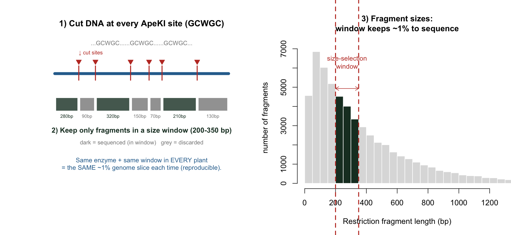
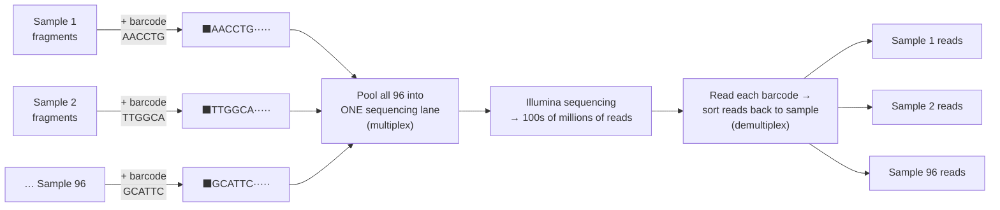
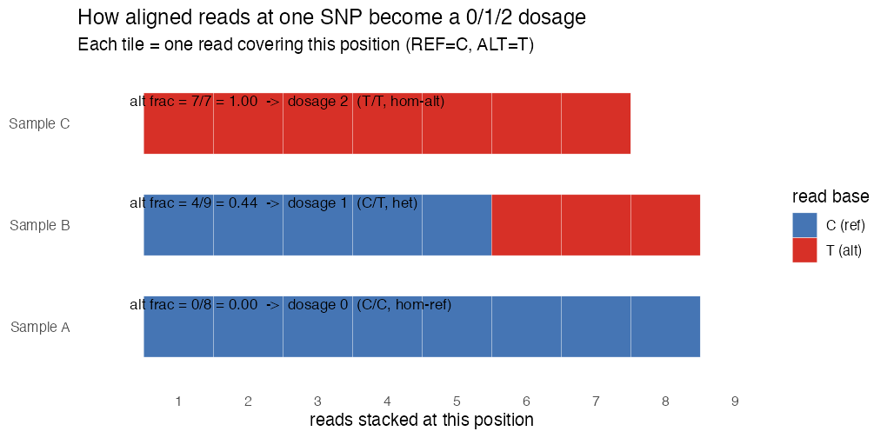
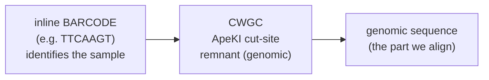
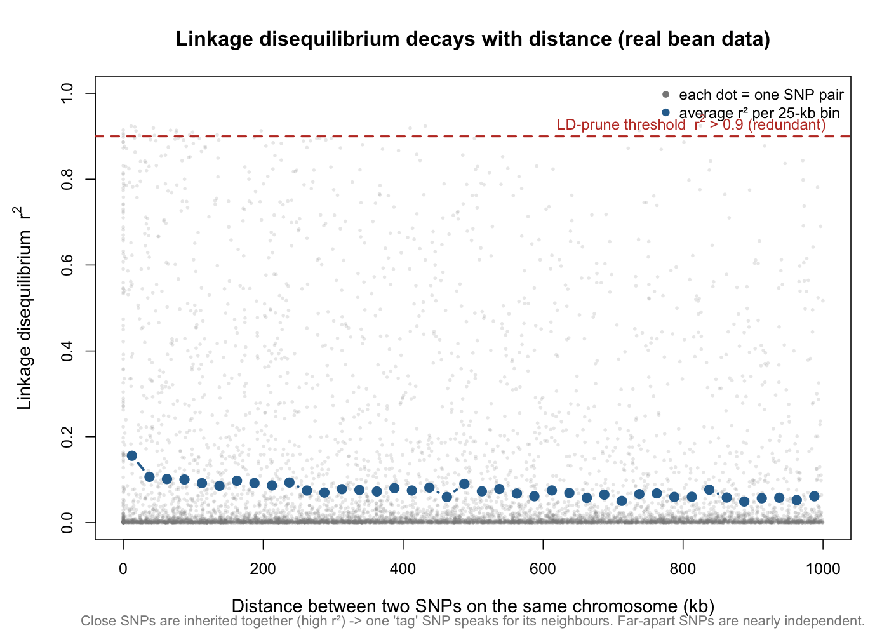

# Lesson 4 — Genotyping by Sequencing & SNPs

> **The question:** A leaf is not a number. How do we go from *DNA in a tube* to the tidy
> **415 × 2,315 matrix of 0/1/2** we met in Lesson 2 — and *why* each cleaning step?
>
> **This lesson is special: we run the real pipeline on the study's own sequencing data** and
> watch a 0/1/2 matrix appear from raw reads. Scripts: `code/05a_demux.py`, `05b_pipeline.sh`,
> `05c_call_genotypes.py`.

---

## 4.1 What is a SNP, really?

DNA is a string from a 4-letter alphabet: **A, C, G, T**. Line up the same chromosome region
from two bean lines and they're identical almost everywhere — *except* at scattered single
positions where one has, say, **A** and another has **G**. Such a position is a **SNP**
(Single-Nucleotide Polymorphism). Its two versions are **alleles**; we count copies of one
allele → **0, 1, 2** (a diploid has two chromosome copies).

🧠 **Intuition.** A SNP is a *fork in the genetic road* shared across the population. Knowing
which fork each line took, at thousands of positions, gives a high-resolution **genetic
fingerprint** that tracks which chromosome segments a line inherited. Genes ride on those
segments, so SNPs are **signposts** for genes we can't see directly.

---

## 4.2 Genotyping-by-Sequencing (GBS): the cheap way to find thousands of SNPs

Whole-genome sequencing every line is expensive. **GBS** sequences only a *reproducible ~1%
slice* of the genome — the same slice in every plant. The trick has three moves:

**Move 1 — cut + size-select (this is the "reduced representation").** A **restriction enzyme**
(here **ApeKI**) is a molecular scissors that cuts DNA *only* where it sees its **recognition site**
`GCWGC` (W = A or T). Because that 5-letter pattern recurs every few hundred bases, the enzyme
chops each plant's genome into millions of fragments — *cut at the exact same places in every
plant*. We then **keep only fragments in a narrow size window** (e.g. 200–350 bp) and sequence just
those. Same enzyme + same window ⇒ the **same ~1% of the genome, every time**:



🧠 **Why this is the whole game.** We don't choose *which* genes to read — the **enzyme's cut-sites
choose the slice for us**, and they fall in the same spots in every plant, so all 415 lines are read
at the **same positions** → directly comparable. The unevenly-spaced SNP map you saw in Lesson 1
(`figures/25_chromosome_map.png`) is exactly the *footprint of where ApeKI happened to cut.*

**Move 2 — barcode + multiplex.** Sequencing one sample at a time wastes a machine that can read
hundreds of millions of fragments at once. So each sample's fragments get a short unique DNA
**barcode** ("name tag") ligated on, and **96 barcoded samples are pooled into one lane**
("multiplexing"). After sequencing, software reads each read's barcode to sort it back to its
sample (**demultiplexing**). This is what `repo/GBS_barcode_plate_info_blb.txt` records.



**Move 3 — sequence.** Run the pooled lane on Illumina → hundreds of millions of short reads, each
carrying its sample's barcode at the front. (We do this for real, on the study's own data, in §4.3.)

🌱 **Breeding logic.** Cutting + size-selecting + multiplexing 96-at-a-time is what makes
genotyping *cheap enough* to run on a whole breeding panel. The entire premise of putting genomics
into a routine breeding pipeline depends on this — GBS makes genomic selection *practical*.

---

## 4.2b 🧸 Toy first — the file formats, and one read → one genotype

Before the real lane (millions of reads), let's meet the **file formats** on toy data so the real
files aren't intimidating.

**(a) FASTQ — one sequencing read = 4 lines.** This is what comes off the machine:
```
@READ_001   AphaeKI read from sample BL1728-5      ← line 1: read name (starts with @)
TTCAAGT CAGC ACGGTTAGCCATTACGGGATACCAGTTACGAC      ← line 2: the DNA bases
+                                                  ← line 3: a separator (+)
IIIIIII IIII IIIIIIIIIIFFFFFFFFAAAAA<<<<<7777      ← line 4: per-base QUALITY (ASCII; I=great, 7=poor)
```
- Line 2 decodes (Lesson 4.3) as `[barcode TTCAAGT][ApeKI remnant CAGC][genomic ...]`.
- Line 4: each character is a quality score for the base above it — this is how "genotype quality <
  30" filtering knows which calls to trust.

**(b) Align, then pile up.** Each read is matched to its place on the reference (Lesson 4.3). Now
look at **one SNP position** where the reference says **C** but some lines carry **T**. Stack the
reads from each sample and *count votes*:



🧮 **The rule (same as §4.3), applied by eye:**
- **Sample A:** 8 C, 0 T → alt fraction 0.00 → **dosage 0** (C/C).
- **Sample B:** 5 C, 4 T → alt fraction 0.44 → **dosage 1** (C/T, heterozygous).
- **Sample C:** 0 C, 7 T → alt fraction 1.00 → **dosage 2** (T/T).

**(c) VCF — where the calls are stored.** The genotype caller writes a **VCF** (Variant Call
Format). One SNP = one row; samples are columns:
```
#CHROM  POS      REF  ALT  ...  FORMAT   SampleA   SampleB   SampleC
chr01   1081554  C    T    ...  GT:DP    0/0:8     0/1:9     1/1:7
```
- `GT` = **genotype**: `0/0`=two ref, `0/1`=one each (het), `1/1`=two alt. `DP`=read depth.
- **The 0/1/2 dosage you model is just the count of "1"s in GT:** `0/0`→**0**, `0/1`→**1**,
  `1/1`→**2**. *That single mapping is the entire bridge from sequencer to the `geno` matrix.*

🔭 **Now the real scale.** The `geno` matrix (415 × 2,315) is just this VCF, turned on its side
(lines as rows, SNPs as columns) with every `GT` replaced by its 0/1/2 count — built from
**millions** of the 4-line FASTQ records above, piled up at **thousands** of positions. Next we do
exactly this on the study's *real* reads.

---

## 4.3 We did it for real — reads → 0/1/2

The study's raw reads live at **NCBI BioProject PRJNA1138671** (mirrored at ENA). There are 5
sequencing lanes, 10–26 GB each. We took the **smallest lane** (`SRR29913416`) and — because
this laptop had ~2 GB free — **streamed a 6-million-read subset** rather than the full 361-million
-read file, and aligned to **chromosome 1 only**. The *logic is identical at full scale*; only the
size differs. Here is exactly what happened.

### Step 0 — look at a raw read
```
@SRR29913416.1 ...
CNGGCCGTACAGCCTTTTCGCAGCCAAATCAACTGCTTTCCCCGCTAGTG
```
A 50 bp read. Reading it left to right we *discover its structure*:


⚠️ Real-data wrinkle we *saw*: sequencing **cycle 2 failed** in the first reads (position 2 = `N`),
so naive exact barcode-matching breaks. We matched barcodes *tolerantly* (ignoring position 2).

### Step 1 — demultiplex (`05a_demux.py`)
Sort reads back to samples by their barcode, then strip the barcode (keep the genomic part):
```
reads=6,000,000   matched=5,871,321 (97.9%)   samples found=91
top samples: BL1728-5 (241,537 reads), BL1709-3 (205,288), BL1728-2 (190,559), ...
```
🔬 **97.9% of reads carried a recognizable barcode** — a healthy library. We kept the 8 best-
covered samples for the demo.

### Step 2 — trim → align → sort (`05b_pipeline.sh`)
Trim low-quality bases/adapters (`fastp`), align to chr01 (`bwa mem`), sort (`samtools`). Real
output:

| sample | trimmed reads | mapped to chr01 | map rate |
|--------|---------------|-----------------|----------|
| BL1728-5 | 239,332 | 40,950 | 17.1% |
| BL1709-3 | 201,757 | 37,706 | 18.7% |
| BL1704-4 | 185,201 | 33,319 | 18.0% |
| … | … | … | … |

🧠 Only ~17% map because we used **1 of 11 chromosomes** — the rest map to chromosomes 2–11 we
didn't download. At full scale you'd align to all 11 and map ~90%+.

### Step 3 — call genotypes (`05c_call_genotypes.py`): *this is where 0/1/2 is born*
At each covered position we pile up the reads from all samples and, **per sample**, count how
many reads support the **reference** allele vs an **alternative** allele, then convert the
**allele fraction** to a dosage:

🧮 **The genotype rule (the simplest honest version):**

First the **alt fraction** $= \dfrac{\text{alt reads}}{\text{ref reads} + \text{alt reads}}$ (each term
is a *count* of reads), then read off the **dosage**:

| alt fraction | dosage | genotype |
|---|---|---|
| ≤ 0.15 | **0** | hom-ref (AA) |
| 0.15 – 0.85 | **1** | heterozygous (Aa) |
| ≥ 0.85 | **2** | hom-alt (aa) |

(too few reads → call it **missing**). Real callers like **NGSEP** (the paper) or `bcftools` use a
genotype-*likelihood* model, but the underlying idea is exactly this: *reads voting on alleles.*

🔬 **The real output — an actual 0/1/2 matrix from the study's DNA:**
```
sample       S01_1081554  S01_2327642  S01_2327647  S01_2327729 ...
BL1728-5     1            1            1            0
BL1709-3     1            0            0            0
BL1728-2     0            1            0            0
BL1704-4     NA           0            1            0
```
That is the **same shape and coding as `GB_BLB$geno`** (Lesson 2) — samples × SNPs, entries
0/1/2. *We built it from raw reads.* (`bioinfo/genotypes_012.tsv`, figure
`figures/08_real_genotype_matrix.png`.)

---

## 4.4 Our demo *accidentally proves why filtering is essential*

Our naive caller reported **~30% heterozygous (1) calls** — and this stayed ~30% even when we
demanded 15 reads per call:

| min depth | SNPs | het-rate |
|-----------|------|----------|
| 5 | 90 | 30.0% |
| 10 | 19 | 29.0% |
| 15 | 7 | 29.5% |

🧠 **Why this is impossible — and therefore informative.** Beans **self-pollinate**, so lines are
near-**homozygous**: real het should be **rare** (~0–5%), not 30%. Persistent high het that
*doesn't* go away with more depth is the fingerprint of **repetitive / paralogous regions** —
reads from two near-identical genome copies collapse onto one position and *look* like a constant
50/50 "heterozygote." This is an **artifact**, not biology.

🌱 **This is exactly what the paper's filters remove.** Now the QC chain makes visceral sense:

| Filter (paper) | Threshold | The artifact it kills |
|----------------|-----------|------------------------|
| Remove **repetitive regions** | — | the paralog-collapse het cloud we just saw |
| **Biallelic** only | 2 alleles | the 0/1/2 model needs exactly two alleles |
| **Genotype quality** | < 30 dropped | low-confidence calls |
| **Heterozygosity** | obs. > 0.05 removed | **directly** removes our 30%-het artifact SNPs |
| **Missingness** | > 20% per SNP | SNPs with too many gaps |
| **MAF** | < 0.01 removed | ultra-rare variants (can't estimate effects) |
| **LD pruning** | r² > 0.9 | redundant near-duplicate SNPs |
| **Imputation** (Beagle) | — | *fills* remaining gaps using genetic neighbors |

After this chain on the *full* data: **2,315 clean SNPs** — the matrix you model in Lessons 6+.

⚠️ **Common confusion — "doesn't filtering throw away real data?"** Yes, deliberately. The goal is
*maximum reliable signal per unit noise*, not maximum SNPs. Our experiment is the proof: skip the
het/repeat filter and 30% of your "signal" is garbage.

---

## 4.5 Two filters worth the math

🧮 **Minor allele frequency (MAF).** With 0/1/2 coding, the alt-allele frequency is just
(column mean)/2, and $\text{MAF}=\min(p,1-p)\in[0,0.5]$. A SNP at MAF 0.005 means ~1 line in 200
carries the rare allele — too rare to estimate an effect, and a magnet for false GWAS hits.
> 🔬 We recomputed MAF on the final `geno`: range ~0.007–0.50, median ≈ 0.03 (`figures/03_maf_histogram.png`),
> consistent with the ≥0.01 filter.

🧮 **Linkage disequilibrium (LD).** Nearby SNPs are inherited together → correlated ($r^2$ high).
Why? Recombination rarely splits a *short* chromosome stretch, so two close SNPs almost always
travel as a unit from parent to offspring; far-apart SNPs get shuffled apart over generations and
drift toward independence. We can **see this decay in the study's own data**:



🧠 **Read it.** On the left (SNPs a few kb apart) $r^2$ is highest; it **falls as SNPs get farther
apart** (blue = average per 25-kb bin). Two consequences fall straight out:
1. **LD pruning is safe.** When two SNPs sit in the same tight block ($r^2>0.9$, red line), they
   carry nearly the *same* information — keep one **tag** SNP and drop the rest, losing almost
   nothing while shrinking the matrix. (This study pruned exactly there.)
2. **Markers can stand in for genes.** A SNP doesn't need to sit *in* a gene — if it's close enough
   to be in LD with the gene, it **rides along** with it. That "riding along" (§4.6) is the entire
   reason marker-based prediction works.

> 🔬 `code/08_biology_figures.R` computed this from `GB_BLB$geno` + positions (25,070 within-
> chromosome SNP pairs ≤ 1 Mb apart). LD starts modest here because the published set was *already*
> LD-pruned — so the strongest redundancies were removed before we ever saw it.

---

## 4.6 The result, and why its *shape* drives everything next

We end with **M**, a 415 × 2,315 matrix in {0,1,2}. Two structural facts shape every later method:

1. **Wide, not tall.** Far more markers (2,315) than lines (415): $p \gg n$. Ordinary
   regression is impossible (more unknowns than equations). This *forces* the shrinkage/
   relationship methods of Lessons 6–8.
2. **Rows are comparable.** Every line scored at the *same* SNPs → we can measure genetic
   *similarity* between any two lines → the genomic relationship matrix (Lesson 6).

🌱 You don't need a marker *in* every gene — just markers *near enough* to ride along (be in LD)
with the genes. That "riding along" is the entire basis of marker-based prediction.

---

## 4.7 Run it yourself
```bash
# (needs bwa, samtools, fastp + python3; see Lesson 16)
python3 code/05a_demux.py 8        # stream-subset already fetched -> demultiplex top 8 samples
bash    code/05b_pipeline.sh        # trim -> align(chr01) -> sort
python3 code/05c_call_genotypes.py  # pileup -> 0/1/2 matrix + het diagnostics
```
> Full-scale notes are in `code/05b_pipeline.sh`: the paper used **Cutadapt + Bowtie2 + NGSEP**;
> we used the equivalent **fastp + bwa + a transparent caller** (and chr01 + a read subset) to fit
> a laptop. Same five logical steps: demultiplex → trim → align → pileup → genotype.

---

> 🔧 **In practice (tools).** Demultiplex/trim: `process_radtags` (Stacks), `Cutadapt`, `fastp`;
> align: `Bowtie2`/`BWA`; call genotypes: **`NGSEP`** (the paper), `bcftools`, or `GATK`; filter
> (MAF, missingness, het, biallelic): `VCFtools`, `PLINK`, `bcftools`; LD pruning & MAF: `PLINK`,
> R's `SNPRelate`; impute: `Beagle`. In R, read the final VCF with `vcfR` and build dosages.

## 4.8 What you should now be able to say
- A **SNP** is a single-position DNA difference, coded as allele-count **0/1/2**; **GBS** cheaply
  finds thousands by cutting (ApeKI) + barcoding + sequencing a reproducible genome slice.
- The pipeline is **demultiplex → trim → align → pileup → call**; we ran it on the study's own
  reads and watched a real 0/1/2 matrix form (`figures/08_real_genotype_matrix.png`).
- Calling 0/1/2 = **reads voting on alleles** (allele fraction → dosage); real callers add a
  likelihood model.
- A naive run gave **30% het** — a repeat/paralog artifact — which is *exactly why* the paper's
  **het/repeat/quality/MAF/LD** filters exist; after them, **2,315** clean SNPs remain.
- The matrix is **wide** ($p\gg n$), which forces the shrinkage methods coming next.

👉 Next: **[Lesson 5 — Quantitative Genetics Foundations](05_quant_genetics_foundations.md)**.
