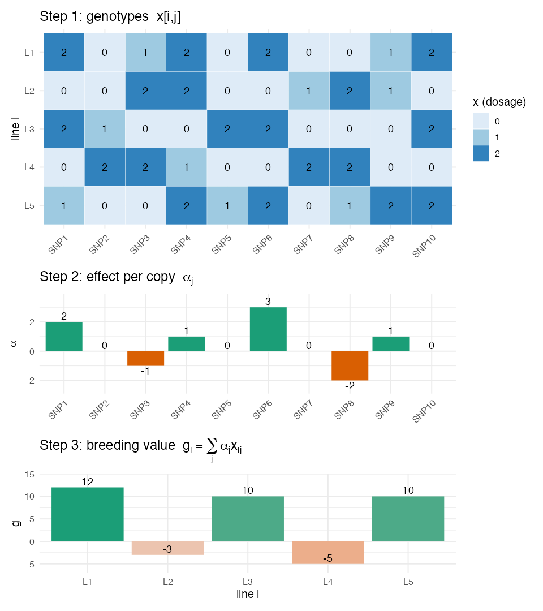

# Lesson 5 — Quantitative Genetics Foundations

> **The question:** Genomic prediction predicts a line's **genetic value**. But what *is* a
> genetic value, in equations? This short lesson gives you the four ideas — **additive
> effect, breeding value, genetic variance, heritability** — that every later model rests on.

You met heritability intuitively in Lesson 3. Now we make it precise enough to *use*.

---

## 5.1 One gene, written as a number

Take a single SNP with alleles, count copies of one allele → $x \in \{0,1,2\}$ (Lesson 2).
Suppose each copy adds, on average, a fixed amount $\alpha$ to the trait. Then that locus
contributes:
$$
\text{contribution} = \alpha \cdot x
$$
- $x=0$: contributes $0$
- $x=1$: contributes $\alpha$
- $x=2$: contributes $2\alpha$

🧠 **Intuition.** $\alpha$ is the **additive effect** — the "price per copy" of the allele.
"Additive" because copies just *add up*. This linear, additive picture is the backbone of
classical quantitative genetics and of GBLUP.

⚠️ **Common confusion — what about dominance/epistasis?** Real genetics also has **dominance**
(the heterozygote isn't exactly halfway) and **epistasis** (genes interacting). The *additive*
part is special because it's the part that **passes reliably from parent to offspring** — so
it's what breeders select on. GBLUP models the additive part; the **kernel** methods of Lesson 8
are a way to *also* capture some non-additive effects.

---

## 5.2 Many genes → the breeding value

A complex trait (yield, appearance) is influenced by **many** loci. Sum each locus's additive
contribution over all $p$ markers:

🧮 **The genetic (breeding) value of line $i$:**
$$
g_i \;=\; \sum_{j=1}^{p} \alpha_j \, x_{ij}
$$
- $x_{ij}$ — line $i$'s genotype (0/1/2) at marker $j$.
- $\alpha_j$ — additive effect of marker $j$.
- $g_i$ — line $i$'s total **breeding value**: the sum of all its allele "prices".

In matrix form for all lines at once: $\mathbf{g} = \mathbf{M}\boldsymbol{\alpha}$, where
$\mathbf{M}$ is the 415 × 2,315 marker matrix and $\boldsymbol{\alpha}$ the vector of effects.

### 🧸 Toy example first — 5 lines, 10 SNPs (so $i$, $j$, $\alpha$, $g$ become concrete)

Symbols are slippery until you compute one by hand. Let's shrink the real 415 × 2,315 matrix to a
toy **$\mathbf{M}$ of 5 lines × 10 SNPs** and *invent* the effects $\boldsymbol\alpha$ (in reality
$\alpha$ is unknown — estimating it is what Lessons 7–8 do; here we hand it to you to see the
machinery). Run `code/toy_05_breeding_value.R`:

**Step 1 — the genotypes $x_{ij}$** (row = line $i$, column = SNP $j$, value = copies 0/1/2):

| line\SNP | 1 | 2 | 3 | 4 | 5 | 6 | 7 | 8 | 9 | 10 |
|---|---|---|---|---|---|---|---|---|---|----|
| **L1** | 2 | 0 | 1 | 2 | 0 | 2 | 0 | 0 | 1 | 2 |
| **L2** | 0 | 0 | 2 | 2 | 0 | 0 | 1 | 2 | 1 | 0 |
| **L3** | 2 | 1 | 0 | 0 | 2 | 2 | 0 | 0 | 0 | 2 |
| **L4** | 0 | 2 | 2 | 1 | 0 | 0 | 2 | 2 | 0 | 0 |
| **L5** | 1 | 0 | 0 | 2 | 1 | 2 | 0 | 1 | 2 | 2 |

**Step 2 — the effect per copy $\alpha_j$** (one number per SNP; + helps the trait, − hurts, 0 = no effect):

| SNP $j$ | 1 | 2 | 3 | 4 | 5 | 6 | 7 | 8 | 9 | 10 |
|---|---|---|---|---|---|---|---|---|---|----|
| $\alpha_j$ | **+2** | 0 | **−1** | +1 | 0 | **+3** | 0 | **−2** | +1 | 0 |

**Step 3 — breeding value $g_i=\sum_j \alpha_j x_{ij}$.** This sum *is* a **matrix × vector**
multiplication, $\mathbf{g}=\mathbf{M}\boldsymbol{\alpha}$. Written out in full, the 5×10 genotype
matrix times the 10×1 effect vector gives the 5×1 breeding-value vector:

$$
\underbrace{\begin{bmatrix}
2&0&1&2&0&2&0&0&1&2\\
0&0&2&2&0&0&1&2&1&0\\
2&1&0&0&2&2&0&0&0&2\\
0&2&2&1&0&0&2&2&0&0\\
1&0&0&2&1&2&0&1&2&2
\end{bmatrix}}_{\mathbf{M}\;(5\times 10)}
\underbrace{\begin{bmatrix}2\\0\\-1\\1\\0\\3\\0\\-2\\1\\0\end{bmatrix}}_{\boldsymbol{\alpha}\;(10\times 1)}
=
\underbrace{\begin{bmatrix}12\\-3\\10\\-5\\10\end{bmatrix}}_{\mathbf{g}\;(5\times 1)}
$$

**How a matrix times a vector actually works:** each entry of $\mathbf{g}$ is the **dot product**
of *one row* of $\mathbf{M}$ with the *whole column* $\boldsymbol\alpha$ — multiply them
position-by-position, then add. Row **L1** with $\boldsymbol\alpha$ (showing only the nonzero terms):

$$
g_{\text{L1}}=\!\!\sum_{j=1}^{10}\alpha_j x_{\text{L1},j}
=\underbrace{2{\cdot}2}_{\text{SNP1}}+\underbrace{(-1){\cdot}1}_{\text{SNP3}}+\underbrace{1{\cdot}2}_{\text{SNP4}}+\underbrace{3{\cdot}2}_{\text{SNP6}}+\underbrace{1{\cdot}1}_{\text{SNP9}}=4-1+2+6+1=\mathbf{12}
$$

And row **L4**, to see a *negative* breeding value appear (its alt alleles sit mostly on the
penalty SNPs, $\alpha_3=-1$, $\alpha_8=-2$):

$$
g_{\text{L4}}=\underbrace{(-1){\cdot}2}_{\text{SNP3}}+\underbrace{1{\cdot}1}_{\text{SNP4}}+\underbrace{(-2){\cdot}2}_{\text{SNP8}}=-2+1-4=\mathbf{-5}
$$

Repeat for all five rows and you read off the result vector
$\mathbf{g}=[\,12,\ -3,\ 10,\ -5,\ 10\,]^{\top}$. **That vector is the ranking a breeder wants** —
L1, L3, L5 are the keepers; L2 and L4 are culls.

🔭 **Now zoom out to the real data.** Picture that little 5×10 grid stretched to **415 rows ×
2,315 columns**, and the $\alpha$ bar-chart to **2,315 bars** (most tiny, a few bigger). The
operation is *identical* — multiply genotypes by effects and sum across the row — just with more
of everything. The single hard difference: in the toy we *knew* $\boldsymbol\alpha$; with real
data we must **estimate** all 2,315 effects from only 415 lines ($p\gg n$), which is impossible by
ordinary regression. That impossibility (§5.5) is the doorway to GBLUP.

🌱 **This is the target of genomic prediction.** A line's **breeding value $g_i$** is exactly
what a breeder wants to rank lines by — it's the heritable, transmissible merit. The phenotype
we observe is $y_i = \mu + g_i + e_i$: breeding value plus environmental noise $e_i$. **We see
$y$; we want $g$.** Every model in this course is a different strategy for recovering $g$ from
$y$ and the markers.

---

## 5.3 The phenotype = signal + noise

🧮 **The decomposition.**
$$
\underbrace{y_i}_{\text{what we measure}} \;=\; \underbrace{\mu}_{\text{mean}} \;+\; \underbrace{g_i}_{\text{genetics (signal)}} \;+\; \underbrace{e_i}_{\text{environment (noise)}}
$$

Taking variances across lines (signal and noise independent):
$$
\sigma_P^2 \;=\; \sigma_g^2 \;+\; \sigma_e^2
$$
total **phenotypic** variance = **genetic** variance + **environmental** variance.

---

## 5.4 Heritability, defined three ways (all the same idea)

🧮 **Narrow-sense heritability:**
$$
h^2 \;=\; \frac{\sigma_A^2}{\sigma_P^2} \;=\; \frac{\text{additive genetic variance}}{\text{total phenotypic variance}}
$$
(Broad-sense $H^2$ uses *all* genetic variance $\sigma_g^2$; for near-homozygous selfed bean
lines the two nearly coincide because most genetic variance is additive.)

Read $h^2$ three equivalent ways:
1. **Fraction of variance that's heritable** (the definition).
2. **The BLUP shrinkage weight** (Lesson 3): how much we trust the data vs. shrink to the mean.
3. **A ceiling on prediction accuracy**: you cannot predict the noise; you can at best recover
   the genetic part, so accuracy is bounded by (a function of) $h^2$.

🌱 **Breeding payoff — the breeder's equation.** Genetic gain per cycle is
$$
\Delta G \;=\; i \, h^2 \, \sigma_P \quad\text{(mass selection form)} \quad\Rightarrow\quad \Delta G = i\,r\,\sigma_A \ \text{(general form)}
$$
where $i$ = selection intensity (how picky you are), $r$ = accuracy of selection, $\sigma_A$ =
additive SD. **This equation is the *reason genomic prediction exists*:** genomic selection
raises $\Delta G$ by (a) increasing **accuracy $r$** on hard-to-measure traits and (b) letting
you select *earlier/faster*, shortening the cycle so $\Delta G$ accumulates per *year* faster.
Everything in this study is ultimately an attempt to push $r$ up.

> 🔬 **In the data — we measured it (`code/07_heritability_accuracy.R`).** For every 2018 trait we
> estimated genomic heritability $h^2_g$ (from GBLUP variance components) *and* the GBLUP
> prediction accuracy, then plotted one against the other:
> **the correlation across traits is r = 0.80** — high-$h^2$ color/L\*/b\* predict at 0.72–0.79,
> while the lowest-$h^2$ trait (days-to-flowering) sits at 0.46. See
> `figures/10_heritability_vs_accuracy.png`. The paper sees the same: **days-to-maturity**'s
> $h^2$ fell 0.77→0.49 from 2018 to 2019 and its accuracy fell with it. **Heritability is not
> abstract — it *is* (most of) the accuracy ceiling.** (These $h^2_g$ are estimated on the cleaned
> BLUPs, so they run a bit higher than the paper's plot-basis values; the *relationship* is the
> point.)

---

## 5.5 The crucial pivot: from effects ($\alpha$) to relationships (G)

Here is the conceptual hinge of the whole course. We wrote breeding value as
$\mathbf{g} = \mathbf{M}\boldsymbol{\alpha}$. To predict, it seems we must estimate all 2,315
effects $\boldsymbol{\alpha}$ — but with only 415 lines ($p \gg n$, Lesson 4) we *can't* do that
by ordinary least squares.

**Two escape routes, and they turn out to be the same math:**
- **Route A (markers):** estimate all $\alpha_j$ but *shrink* them toward 0 (penalize big
  effects). This is **ridge regression / RR-BLUP** (Lesson 7).
- **Route B (relationships):** never estimate individual $\alpha_j$; instead use the fact that
  *genetically similar lines have similar breeding values*. Summarize similarity in one
  **genomic relationship matrix G** (Lesson 6) and predict via that. This is **GBLUP**.

🧠 **Intuition for why B works.** You don't need to know *which* genes a champion line carries
to predict its relatives are good — you just need to know *who its relatives are*. Pedigree
breeders did this for a century with family trees; markers let us measure relatedness directly,
even between lines with no recorded pedigree.

It is a beautiful and load-bearing fact that **Route A and Route B give identical predictions.**
We'll see *why* in Lesson 7. For now, internalize the pivot:

> **Predicting breeding values ≠ finding genes. It = exploiting relatedness.**

This is also exactly why **GWAS** (finding genes, Lesson 9) and **GP** (predicting, Lesson 7)
are *different jobs*: GWAS asks "*which* loci?", GP asks "*how good* is this line?" — and the
study's Objective 3 is the surprising discovery that doing the first does **not** automatically
help the second.

---

## 5.6 What you should now be able to say
- An **additive effect** $\alpha_j$ is the per-copy value of an allele; a **breeding value**
  $g_i = \sum_j \alpha_j x_{ij}$ is the sum over all loci — the heritable merit we want to rank.
- Phenotype = mean + breeding value + environment; **heritability** $h^2=\sigma_A^2/\sigma_P^2$
  is the genetic fraction, and it **caps prediction accuracy** and drives **genetic gain**
  ($\Delta G = i\,r\,\sigma_A$).
- Because $p \gg n$, we predict breeding values via **shrinkage on markers (ridge)** or,
  equivalently, via **relatedness (G matrix / GBLUP)** — *not* by finding individual genes.

👉 Next: **[Lesson 6 — The Genomic Relationship Matrix G](06_genomic_relationship_matrix.md)** —
we build the relatedness matrix by hand.
