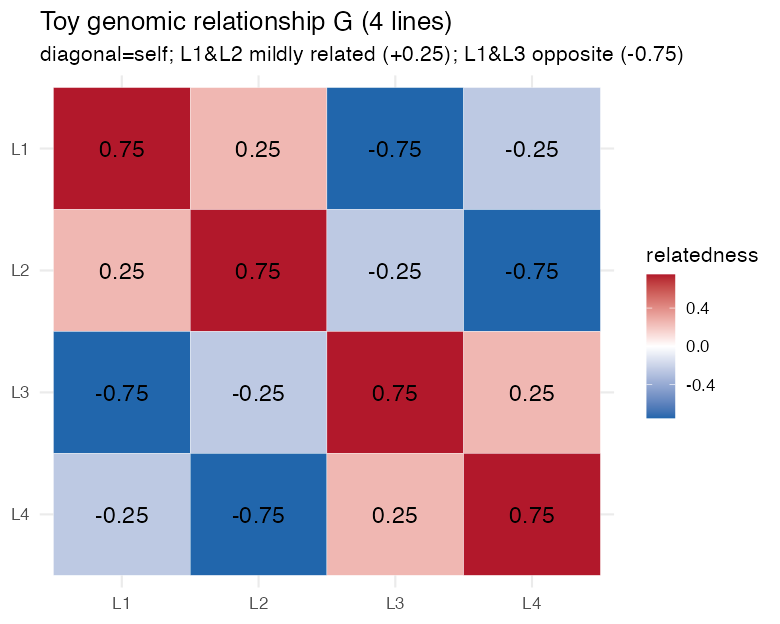
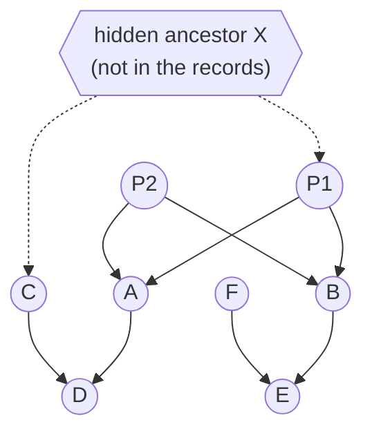
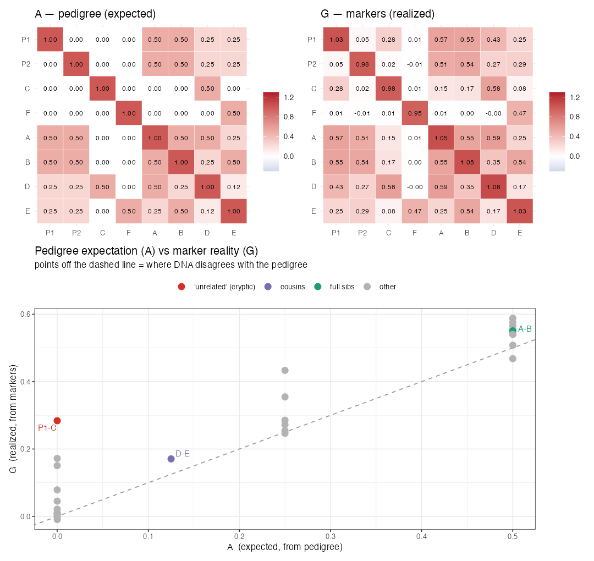

# Lesson 6 — The Genomic Relationship Matrix **G**

> **The question:** Lesson 5 said prediction = *exploiting relatedness*. So we need a precise,
> number-for-number answer to **"how genetically related is line $i$ to line $j$?"** for all
> pairs. That answer is the matrix **G**. We build it by hand on 4 lines, then on the real 415.

---

## 6.1 What G is

**G** is a square table, one row and one column per line (415 × 415 here). Entry $G_{ij}$
measures the **genomic relationship** (realized kinship) between lines $i$ and $j$:

- **Large positive** $G_{ij}$ → lines share many alleles → closely related.
- **Near zero** → unrelated.
- **Negative** → *less* related than two random lines (more genetically opposite than average).
- The **diagonal** $G_{ii}$ ≈ how inbred/typical line $i$ is (≈1 on average).

🧠 **Intuition.** G is a *friendship-by-DNA* map. Pedigree breeders drew family trees to guess
relatedness ("these two are cousins → ~12.5% shared"). Markers let us **measure** it directly —
and catch surprises a pedigree misses (two "unrelated" lines that happen to share a lot, or full
sibs that drifted apart). G is the *data-driven* upgrade of the pedigree relationship matrix.

---

## 6.2 The formula (VanRaden 2008) — exactly what the paper used

🧮 **Step by step.** Start from the marker matrix $\mathbf{M}$ (415 × 2,315, entries 0/1/2).

1. **Center & scale each SNP column** → matrix $\mathbf{Z}$. For SNP $j$ with mean $2p_j$ and
   SD $s_j$:

```math
Z_{ij} = \frac{M_{ij} - 2p_j}{s_j}
```

   Centering removes the "average dose" so we measure *deviation* from the population; scaling
   puts every SNP on a comparable footing.
2. **Cross-multiply and average over markers:**

```math
\boxed{ \mathbf{G} = \frac{\mathbf{Z}\mathbf{Z}^{\top}}{p} } \qquad (p = \text{number of markers})
```

In R this is literally the line the authors wrote (and we reproduced):
```r
Z <- scale(M)              # center + scale every SNP
G <- tcrossprod(Z) / ncol(M)   # Z Z' / p
```

🧠 **Why this *is* relatedness.** $G_{ij} = \frac{1}{p}\sum_j Z_{ij}Z_{kj}$ is just the **average
product of standardized genotypes** across all SNPs — i.e. how *correlated* lines $i$ and $j$
are across the genome. If they tend to be high together and low together at the same SNPs, the
products are positive and pile up → big $G_{ij}$. It's a correlation in disguise.

---

## 6.3 Build it by hand — 4 lines, 3 SNPs

Take a toy with 4 lines and 3 SNPs (we ran this in R):

```
M (0/1/2):              Z (centered+scaled):        G = ZZ'/p:
   SNP1 SNP2 SNP3           SNP1  SNP2  SNP3            L1    L2    L3    L4
L1   2    2    0      L1   0.87  0.87 -0.87     L1   0.75  0.25 -0.75 -0.25
L2   2    0    0      L2   0.87 -0.87 -0.87     L2   0.25  0.75 -0.25 -0.75
L3   0    0    2      L3  -0.87 -0.87  0.87     L3  -0.75 -0.25  0.75  0.25
L4   0    2    2      L4  -0.87  0.87  0.87     L4  -0.25 -0.75  0.25  0.75
```

Read the result like a breeder:
- **$G_{12}=0.25$** (L1 vs L2): they match at SNP1 (both 2) and SNP3 (both 0) but differ at
  SNP2 → mildly related. ✔ makes sense.
- **$G_{13}=-0.75$** (L1 vs L3): opposite at *every* SNP → strongly *un*alike, below average. ✔
- **$G_{11}=0.75$** (diagonal): L1's relationship with itself = how far it sits from the
  population average across SNPs.

That's the whole idea. The same toy as a **color heatmap** (run via `code/`):



🔭 **Zoom out:** the real G is this exact picture at **415 × 415** — a giant heatmap whose red
blocks are families of related lines and blue regions are unrelated pairs (we draw the real one in
§6.4). The real G just does this over 2,315 SNPs and 415 lines.

> 🔬 **In the data.** For the real matrix (`code/02_gblup_from_scratch.R`): mean diagonal ≈
> **0.998** (≈1, as designed) and mean off-diagonal ≈ **−0.002** (≈0 — the *average* pair is
> unrelated, by construction of centering). Individual pairs depart from 0 — and *that variation*
> is the signal prediction feeds on.

---

## 6.3b 🧸 Pedigree kinship vs. marker reality — and the two glitches markers fix

Before markers, breeders measured relatedness from a **pedigree** (family tree). It's worth seeing
this older method *and why DNA improves on it* — it's the whole reason the paper uses a marker **G**.
Run `code/toy_06_pedigree_kinship.R`.

### The toy pedigree
Founders **P1, P2, C, F**; full sibs **A, B** (= P1×P2); and **D** (= A×C), **E** (= B×F):



### Pedigree expectation: the relationship matrix A (by hand)
The **numerator relationship matrix A** is built by one rule applied top-down (the *tabular
method*): for individual $i$ with parents $s,d$,

```math
A_{ij}=\tfrac12 (A_{js}+A_{jd}), \qquad A_{ii}=1+\tfrac12 A_{sd}
```

Unknown parents ⇒ treat as unrelated founders ($A=0$). This gives **expected** relationships:

| pair | meaning | pedigree $A$ | kinship $A/2$ |
|------|---------|--------------|----------------|
| A, B | full sibs | **0.500** | 0.250 |
| D, E | first cousins | **0.125** | 0.062 |
| P1, C | "unrelated" founders | **0.000** | 0.000 |

⚠️ Notice **A gives one fixed number per relationship type** — *every* full-sib pair is exactly
0.50, by assumption.

### Marker reality: realized G — and where it disagrees
Now we *gene-drop* DNA through the pedigree and compute the marker **G** (VanRaden, §6.2, centered on
founder allele frequencies). G measures what each pair **actually** inherited:



🔬 Two disagreements pop out (points off the dashed line):

1. **Mendelian sampling — "every full sib is 0.50" is only an *average*.** The pedigree says
   A,B = 0.50; the markers say **G = 0.55**. Full sibs each draw a *random half* of each parent's
   genome, so realized sharing scatters around 0.50 (some sib pairs 0.4, some 0.6). Pedigree A
   can't see this; **G can**. Selecting on realized relationships is more accurate.
2. **Cryptic relatedness — markers catch what the pedigree missed.** The records call P1 and C
   *unrelated founders* (A = 0.00). But they secretly share an unrecorded ancestor **X** (they're
   really half-sibs). The markers expose it: **G = 0.28**. Incomplete pedigrees are the norm in
   real breeding programs — DNA doesn't rely on paperwork.

### Why this is the bridge to the paper
🌱 The black bean panel comes from **two programs (MSU, USDA-ARS)** with **different, often
incomplete pedigrees** — there's no single reliable family tree linking all 415 lines. And even
where pedigrees exist, **realized** relatedness (what GP actually needs, Lesson 7) beats pedigree
*expectations*. So the authors compute relatedness straight from **2,315 SNPs** — exactly the
marker **G** of §6.2. The toy is the study in miniature: *replace the family tree with DNA, gain
both accuracy (Mendelian sampling) and coverage (cryptic relatedness).*

> 🔧 **In practice (R).** Pedigree **A**: `AGHmatrix::Amatrix()`, `nadiv::makeA()`, or `pedigreemm`.
> Marker **G**: `rrBLUP::A.mat()`, `AGHmatrix::Gmatrix()`, or `sommer::A.mat()` — all implement the
> VanRaden formula we wrote by hand in §6.2. (We built both from scratch here so the machinery is
> visible.)

---

## 6.4 Reading the real G: population structure

A heatmap of G (paper's Fig. 1a) shows **blocks** along the diagonal: lines from the same
**breeding program × cycle** light up as related clusters, while across-program pairs stay near
zero. We reproduced this two ways:

🔬 **Kinship by group** (`figures/05_kinship_dist.png`): relationships are clearly **higher
*within* a breeding cycle than *between* cycles** — because each cycle is selected from a limited
set of shared parents.

🔬 **PCA of G** (`figures/04_pca_structure.png`): the first two eigenvectors of G separate the
lines into groups. (PCA of G = principal components of genetic relatedness; the leading PCs *are*
the major axes of population structure.)

🌱 **Why a breeder cares about these blocks — two consequences that drive the whole study:**
1. **Prediction works best within a block.** If your training set is closely related to your
   target lines (same cycle/program), G has strong positive entries linking them → high accuracy.
   Predict *across* blocks (cycle 1 → cycle 2) and the linking entries shrink → accuracy drops.
   **This is the entire story of Lesson 14** (and why the paper's across-cycle accuracies are
   lower until new-cycle lines are added to training).
2. **Structure confounds GWAS.** If a whole subpopulation happens to both carry an allele *and*
   have high yield (for unrelated reasons), a naive test flags a false association. That's why
   GWAS (Lesson 9) must *correct* for structure — using the very PCs we just computed from G.

---

## 6.5 Two roles G plays (don't confuse them)

| Role | Where | What G does |
|------|-------|-------------|
| **Covariance of breeding values** | GBLUP (Lesson 7) | $\mathbf{g} \sim N(\mathbf 0,  \mathbf G \sigma_g^2)$ — relatives have correlated genetic values |
| **Diagnostic of structure** | EDA / GWAS (Lesson 9) | its PCs reveal subpopulations to correct for |

The first role is the engine of prediction: by declaring "breeding values are *correlated
according to G*", the model can infer an unseen line's value from its relatives' phenotypes.

---

## 6.6 Why G beats counting shared genes one-by-one

You might ask: why not just find the trait genes and check who shares them? Because (a) we
mostly don't *know* the genes (Lesson 5's pivot), and (b) **G aggregates tiny signals from all
2,315 SNPs at once.** Complex traits are built from many small effects; G captures their *net*
relatedness without needing to identify any single one. This is precisely why genomic prediction
outperforms marker-by-marker (QTL) selection for polygenic traits like yield.

---

## 6.7 What you should now be able to say
- **G** is the 415×415 genomic relationship matrix; $G_{ij}$ = average product of standardized
  genotypes = realized relatedness.
- Build it by **center+scale markers → $\mathbf{Z}$**, then $\mathbf{G}=\mathbf{Z}\mathbf{Z}^\top/p$.
- Its **diagonal ≈ 1**, **mean off-diagonal ≈ 0**; **blocks** reveal program/cycle structure
  (within-cycle relatedness > between-cycle).
- G plays two roles: **covariance of breeding values** (powers GBLUP) and **structure
  diagnostic** (powers GWAS correction). The block structure foreshadows *within-cycle accuracy >
  across-cycle accuracy*.

👉 Next: **[Lesson 7 — GBLUP](07_GBLUP.md)** — we feed G into a mixed model and actually predict
(and reproduce accuracy 0.64).
