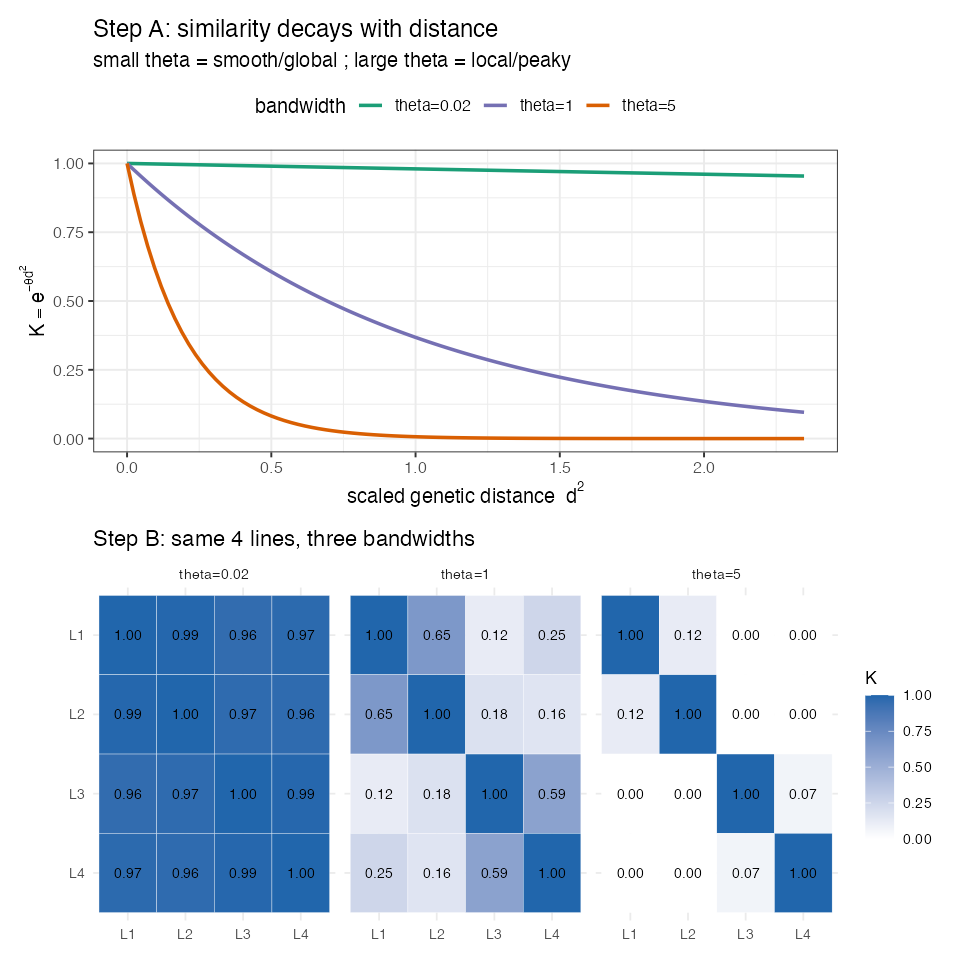

# Lesson 8 — RKHS & Gaussian Kernels

> **The question:** GBLUP assumes genetic merit is a **linear, additive** function of markers.
> But genes interact (dominance, epistasis — Lesson 5). Can we let the model capture **non-linear**
> patterns of similarity, and does it predict better? This is the **RKHS / Gaussian-kernel**
> approach, and the **kernel-averaging (KA)** trick the authors settled on.

---

## 8.1 From "relationship matrix" to "kernel" — same shape, richer meaning

In GBLUP we used $\mathbf G$ to say how similar lines are. A **kernel** $\mathbf K$ is the same
*kind* of object — a square line-by-line similarity matrix — but computed by a more flexible
rule. Swap $\mathbf G$ for $\mathbf K$ in the exact same mixed model and you have **RKHS**
(Reproducing Kernel Hilbert Space) regression:

$$
\mathbf y = \mathbf 1\mu + \mathbf u + \mathbf e, \qquad \mathbf u \sim N(\mathbf 0,\ \mathbf K\,\sigma^2)
$$

🧠 **Intuition.** GBLUP's G measures similarity as a *straight-line* (linear) correlation across
SNPs. A kernel can measure similarity in a *curved* way — "very similar genotypes count as
strongly related, but similarity drops off sharply as genotypes diverge." That curve lets the
model fit interactions between loci that a purely additive model can't see.

---

## 8.2 The Gaussian kernel

The authors use the **Gaussian (RBF) kernel**. For lines $i$ and $j$:

🧮

$$
K_{ij} = \exp\!\big(-\theta\, d_{ij}^2\big)
$$

- $d_{ij}^2$ — the **squared genetic distance** between lines $i$ and $j$ (squared Euclidean
  distance between their marker vectors), scaled by its mean.
- $\theta$ — the **bandwidth** (how fast similarity decays with distance).
- $\exp(-\cdot)$ — guarantees $K_{ij}\in(0,1]$: identical lines → $d=0$ → $K=1$; very different
  lines → large $d$ → $K\approx 0$.

In the repo this is literally:
```r
D <- as.matrix(dist(M, method="euclidean"))^2   # squared distances
D <- D / mean(D)                                 # scale
K <- exp(-h * D)                                 # Gaussian kernel, bandwidth h
```

🧠 **Intuition for bandwidth $\theta$ (called `h` in the code).** It sets how quickly "related"
fades to "unrelated":
- **Small $\theta$** (e.g. 0.02): similarity decays slowly → almost everyone counts as somewhat
  related → a *smooth, global, GBLUP-like* model.
- **Large $\theta$** (e.g. 5): similarity decays fast → only near-identical lines count → a
  *local, wiggly* model that keys on close neighbors and can capture sharp interaction effects.

The right $\theta$ depends on the trait and data — and you don't know it in advance. That problem
motivates the next trick.

---

## 8.3 Kernel Averaging (KA) — the authors' chosen method

Instead of betting on one bandwidth, the authors fit **three** Gaussian kernels at once —
$\theta \in \{0.02,\ 1,\ 5\}$ (a "smooth", a "medium", and a "local" view) — and let the model
**weight them automatically**:

🧮 **KA model.**

$$
\mathbf y = \mathbf 1\mu + \mathbf u_1 + \mathbf u_2 + \mathbf u_3 + \mathbf e, \qquad
\mathbf u_b \sim N(\mathbf 0,\ \mathbf K_b\,\sigma_b^2)
$$

with $\mathbf K_b = \exp(-\theta_b \mathbf D)$. The variance components $\sigma_b^2$ are learned
from the data, so the model **decides how much smooth vs. local structure each trait needs** —
no manual tuning. This is exactly the repo code:
```r
h <- c(.02, 1, 5)
KList <- lapply(h, function(hi) list(K = exp(-hi * D), model = "RKHS"))
fmKA  <- BGLR(y = yNA, ETA = KList, nIter = 12000, burnIn = 2000)   # 3 kernels averaged
```

🧠 **Intuition.** KA is an *ensemble of resolutions*. Rather than guess whether a trait is
governed by broad polygenic background (small $\theta$) or sharper local interactions (large
$\theta$), you supply all three and the data apportions the weight. It's robust because it can't
badly mis-tune a single bandwidth.

🌱 **Breeding logic — why bother going non-linear?** If non-additive effects (gene interactions)
matter for a trait, a method that can model them may rank lines more accurately. The cost is a
slightly more complex model and that the captured non-additive part is **less transmissible** to
offspring than pure additive value — so for *parent selection* additive GBLUP is often preferred,
while for *predicting the line's own performance* the kernel may win.

---

## 8.3b 🧸 Toy first — watch the bandwidth knob turn (`code/toy_08_kernels.R`)

Take **4 lines**, compute their scaled squared genetic distances $d^2$, then turn the bandwidth
knob $\theta$ and watch similarity change:

**Step A — the decay curve $K=e^{-\theta d^2}$.** Same distance, three bandwidths:

| $\theta$ | behaviour | a far-apart pair ($d^2\!\approx\!2$) gets… |
|----------|-----------|---------------------------------------------|
| **0.02** | decays *barely* | $K\approx 0.96$ — *almost everyone counts as related* (smooth/global, ≈ GBLUP) |
| **1** | decays moderately | $K\approx 0.13$ |
| **5** | decays *fast* | $K\approx 0.00$ — *only near-identical lines count* (local/peaky) |

**Step B — the same 4×4 kernel matrix at each $\theta$.** At $\theta=0.02$ every cell is ~1 (one
big blurry family); at $\theta=5$ only the diagonal survives (each line is an island):



🧠 **This is the whole reason for kernel averaging.** No single $\theta$ is "right" — the toy shows
they describe *different* relatedness worlds. So **KA** (§8.3) hands the model all three and lets
the data weight them. 🔭 **Zoom out:** the real kernels are **272×272** built from 2,315-SNP
distances, but each is exactly one of these three "blur levels" — and KA blends them per trait.

---

## 8.4 What the reproduction shows

🔬 **In the data (paper's Fig. 2, and our `code/01`/`02` setup).** Across traits and both years:
- GBLUP and Gaussian-kernel models were **broadly comparable**, but **KA was slightly and
  *consistently* better** — an average improvement of about **+0.03 in accuracy** over GBLUP.
- Among single bandwidths, none of K1/K2/K3 was uniformly best — *which is the whole point of
  averaging them.* KA ≥ the best single kernel, reliably.
- Because KA was the consistent (if modest) winner, the authors **carried GBLUP and KA forward**
  as the two representative GP models for all later comparisons (GWAS-assisted, multi-trait,
  across-cycle).

⚠️ **Common confusion — "+0.03 is tiny, why care?"** In genomic selection, small, *consistent*
accuracy gains compound over many cycles of selection into real genetic gain (recall
$\Delta G = i\,r\,\sigma_A$ — every bit of $r$ counts). A method that's *reliably* a hair better,
with no extra data cost, is worth adopting.

---

## 8.5 RKHS in the family tree of models

| Model | Similarity rule | Captures | This study |
|-------|-----------------|----------|------------|
| **GBLUP** | linear: $\mathbf G=\mathbf Z\mathbf Z^\top/p$ | additive effects | baseline |
| **RKHS (1 kernel)** | Gaussian $\exp(-\theta d^2)$ | additive + some non-additive | depends on $\theta$ |
| **KA (3 kernels)** | mixture of bandwidths | adapts smooth↔local automatically | **chosen GP model** |

All three plug into the **same** mixed-model machinery of Lesson 7 — only the similarity matrix
changes. That's the unifying insight: **GBLUP and RKHS are one framework; the kernel is the
knob.**

---

> 🔧 **In practice (R).** RKHS / Gaussian kernels: **`BGLR`** — pass a *list* of `RKHS` terms with
> kernels at several bandwidths and it fits **kernel averaging (KA)** automatically (exactly the
> paper's setup). `sommer` offers a Gaussian kernel (`GK`); `GAPIT` exposes kernel options too.
> The squared-distance matrix is just `as.matrix(dist(M))^2` scaled by its mean.

## 8.6 What you should now be able to say
- An **RKHS / kernel** model is GBLUP with the relationship matrix **G** replaced by a flexible
  **kernel K**; the **Gaussian kernel** $K_{ij}=\exp(-\theta d_{ij}^2)$ turns genetic distance
  into similarity, with **bandwidth $\theta$** controlling smooth (global) vs. local fitting.
- **Kernel averaging (KA)** fits several bandwidths (0.02, 1, 5) and lets the data weight them,
  avoiding manual tuning.
- Kernels can capture **non-additive** structure; here **KA was consistently ~0.03 better than
  GBLUP**, so GBLUP + KA were the two GP models taken forward.

👉 Next: **[Lesson 9 — GWAS with FarmCPU](09_GWAS_FarmCPU.md)** — switching jobs from *predicting
lines* to *finding the loci*.
