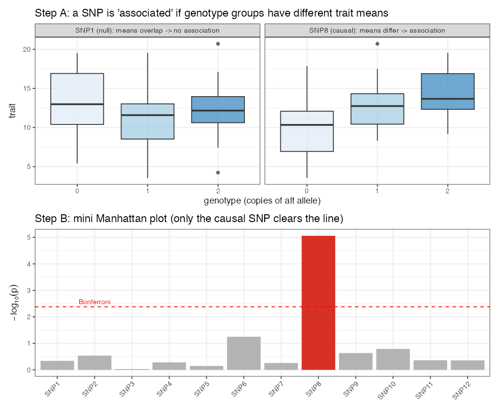

# Lesson 9 — GWAS with FarmCPU

> **The question:** Up to now we've *predicted lines* without caring which genes matter. GWAS
> asks the **opposite** question: *which specific SNPs are statistically associated with the
> trait?* This is a **different job** from prediction (Lesson 5's pivot). Here's how it works,
> why population structure makes it tricky, and what we found in the real data.

---

## 9.1 The core idea: one SNP at a time

A genome-wide association study (GWAS) **tests every SNP, one at a time**, for a statistical
association with the trait. For SNP $j$:

🧮 **The per-SNP model.**

```math
\mathbf y = \mu + \underbrace{x_j \beta_j}_{\text{this SNP's effect}} + \underbrace{\mathbf{Q}\boldsymbol\gamma}_{\text{structure correction}} + \mathbf e
```

- $x_j$ — genotypes (0/1/2) at SNP $j$.
- $\beta_j$ — its effect; **we test $H_0: \beta_j = 0$** and get a **p-value**.
- $\mathbf Q$ — covariates correcting for population structure (see §9.3).

Do this 2,315 times → 2,315 p-values → a **Manhattan plot**.

🧠 **Intuition.** A SNP "associated" with high yield is one where lines carrying allele *A* tend
to yield more than lines carrying allele *G*. The p-value asks: *could this difference be chance?*
Small p (tall point on the Manhattan plot) = unlikely chance = candidate locus.

⚠️ **Common confusion — association ≠ causation.** A significant SNP is usually **not** the
causal gene; it's a **signpost** in **linkage disequilibrium** (Lesson 4) with the real culprit
nearby. GWAS narrows you to a *region*, not a gene.

---

## 9.2 The multiple-testing problem and Bonferroni

Test 2,315 SNPs at the usual $\alpha=0.05$ and, *even if nothing is real*, you'd expect
$\approx 2315\times0.05 \approx 116$ "significant" hits by pure chance. Useless. So we make the
threshold much stricter.

🧮 **Bonferroni correction.**

```math
\alpha_{\text{adj}} = \frac{0.05}{\text{number of SNPs}} = \frac{0.05}{2315} = 2.16\times10^{-5}
```

A SNP must beat *this* p-value to count. On the Manhattan plot it's the dashed line at
$-\log_{10}(2.16\times10^{-5}) \approx 4.67$.

> 🔬 **In the data.** Our reproduction (`code/03_gwas.R`) computes this threshold as exactly
> **2.16×10⁻⁵** — matching the paper's stated value to the digit. (Good sign our setup matches
> theirs.) Bonferroni is *conservative* (it controls the chance of *any* false positive), which
> the authors note can cause it to miss real small-effect loci — relevant in Lesson 10.

---

## 9.2b 🧸 Toy first — build a Manhattan plot from scratch (`code/toy_09_gwas.R`)

Simulate **80 lines** and **12 SNPs**, where *only* **SNP8** truly affects the trait
($y = 10 + 3\!\cdot\!x_{\text{SNP8}} + \text{noise}$). Then test each SNP, exactly as GWAS does.

**Step A — what "association" means.** Split the lines by their genotype (0/1/2) at a SNP and look
at the trait:
- **SNP8 (causal):** the 0, 1, 2 groups have clearly *different* means (more alt copies → higher
  trait) → small p-value.
- **SNP1 (null):** the groups *overlap* → large p-value.

**Step B — the mini Manhattan.** Plot $-\log_{10}(p)$ for all 12 SNPs with the Bonferroni line at
$0.05/12$:



🔬 Real toy numbers: SNP8 has $p = 8.7\times10^{-6}$ → **clears** the Bonferroni line; the best null
SNP only reaches $p = 0.056$ → stays under it. *Exactly one bar pokes through* — and it's the real
one.

🔭 **Zoom out:** the real study tests **2,315** SNPs (so the Bonferroni line moves to
$0.05/2315 = 2.16\times10^{-5}$), adds **3 PCs** to defuse population structure (§9.3), and uses
the smarter iterative FarmCPU — but every bar on a real Manhattan plot is one of these little
per-SNP tests. (See the *real* Manhattan in §9.5: high $h^2$ color has many bars over the line,
low $h^2$ yield almost none.)

---

## 9.3 Population structure — the silent troublemaker

Recall (Lesson 6) the lines cluster by program/cycle. Suppose the MSU subpopulation happens to
both (a) carry allele *A* at some SNP *and* (b) yield higher — **for unrelated reasons** (maybe
MSU just bred higher-yielding backgrounds). A naive test sees "allele *A* ↔ high yield" and
screams *association* — a **false positive driven by structure**, not biology.

🧠 **Intuition.** It's the classic confounder: ice-cream sales correlate with drownings (both
caused by summer). Population structure is the "summer" confounding SNPs with traits.

**Fix:** include the **first 3 principal components** of the marker matrix as covariates
($\mathbf Q$ above). Those PCs *are* the major axes of structure (Lesson 6's PCA of G), so
conditioning on them removes the subpopulation confounding before testing each SNP. The authors
use **3 PCs**; our reproduction does the same.

---

## 9.4 FarmCPU — the specific method used

The authors run GWAS with **FarmCPU** (Fixed and random model Circulating Probability
Unification), in the R package **GAPIT3**. You don't need its internals, but the idea is worth a
sentence:

🧠 **Intuition.** Simple single-marker tests have a dilemma: correct for *too little* structure
→ false positives; correct with a full kinship random effect → you can *over*-correct and bury
real signals. **FarmCPU breaks the deadlock** by **iterating**: it alternates between (1) a
*fixed-effect* model that tests SNPs while controlling for a handful of already-found associated
markers (called pseudo-QTNs), and (2) a *random-effect* model that re-selects which markers to
control for. This "circulating" between the two models gives more **power** with controlled
false positives than a one-shot test.

⚠️ Our `code/03_gwas.R` uses a **simpler single-marker, PC-corrected scan** (so you can read
every line and we avoid the heavy GAPIT install). It captures the *concept*; FarmCPU is more
powerful and will find a somewhat different set. Both share the same threshold logic.

---

## 9.5 Heritability decides how much you discover

🔬 **In the data** — we ran the scan on two traits to make a point:

| Trait | Heritability | SNPs passing Bonferroni (our scan) |
|-------|--------------|-----------------------------------|
| **Yield 2018** | lower | **4** |
| **Color 2018** | higher | **105** |

> Figure: `figures/06_manhattan.png` — yield's Manhattan is nearly flat (few, low peaks); color's
> has tall, clear peaks.

🧠 **Why the huge difference?** Two reasons, both already in your toolkit:
1. **Heritability** (Lesson 5): color is highly heritable → strong genetic signal → easy to
   detect. Yield is noisier → weak per-SNP signals.
2. **Genetic architecture**: color is more **oligogenic** (a few larger-effect loci → tall
   peaks), while yield is **polygenic** (thousands of tiny effects, none individually beating
   Bonferroni — the classic "missing heritability" picture).

🌱 **This foreshadows Lesson 10's surprise.** Yield is governed by *many tiny* effects, so the
handful of SNPs GWAS can detect explain very little of it. Forcing those few SNPs into a
prediction model as "important" therefore *can't help much* — and, as we'll see, actually
*hurts*. The Manhattan plot's flatness for yield is a visual preview of why GWAS-assisted GP
underperformed for the very trait breeders care most about.

---

## 9.6 What the authors actually found

Across their 100 training subsets, FarmCPU flagged **555 SNP–trait associations** in total — but
only **52 showed up in ≥20 subsets**, and **9 in >50**, and **none in all 100**. In other words:

🔬 **GWAS hits were *unstable*** — change which lines you analyze and you get different "top"
SNPs. They also saw a positive correlation between a marker's mean effect and its standard
deviation across subsets (big effects were also the most variable). This instability is the
central evidence for Lesson 10: if you can't even agree on *which* SNPs matter, baking them into
a predictor as fixed truths is risky.

---

## 9.7 GWAS vs. GP — keep the two jobs straight

| | **GWAS** (Lesson 9) | **Genomic Prediction** (Lessons 7–8) |
|--|--------------------|---------------------------------------|
| Question | *Which* loci are associated? | *How good* is each line? |
| Output | p-value per SNP, Manhattan plot | one predicted breeding value per line |
| Uses all markers? | tests one at a time (+ structure) | uses all jointly via G/kernel |
| Best for | understanding architecture, finding candidate genes | selecting/ranking lines |

The study's clever move (Objective 3) is to ask: **can the *output* of GWAS feed the *input* of
GP?** That's Lesson 10.

---

> 🔧 **In practice (R).** GWAS: **`GAPIT3`** (the paper — `FarmCPU`, `BLINK`, `MLM`, `MLMM`),
> `rMVP` (fast, large data), or `statgenGWAS`; structure PCs come from `prcomp`/`SNPRelate`. Our
> `03_gwas.R` codes the PC-corrected single-marker scan by hand so every step is visible.

## 9.8 What you should now be able to say
- GWAS **tests each SNP** for trait association, producing p-values and a **Manhattan plot**;
  significance uses a **Bonferroni** threshold ($0.05/2315 = 2.16\times10^{-5}$).
- **Population structure** confounds associations; correct with the **first 3 PCs** of the
  markers. **FarmCPU** iterates fixed/random models for more power.
- **High $h^2$, oligogenic** traits (color: 105 hits) are easy to map; **low $h^2$, polygenic**
  traits (yield: 4 hits) are not — and GWAS hits here were **unstable** across subsets.
- GWAS (find loci) and GP (rank lines) are **different jobs**.

👉 Next: **[Lesson 10 — GWAS-assisted Genomic Prediction](10_GWAS_assisted_GP.md)** — feeding
GWAS hits into the predictor, and why it backfired.
