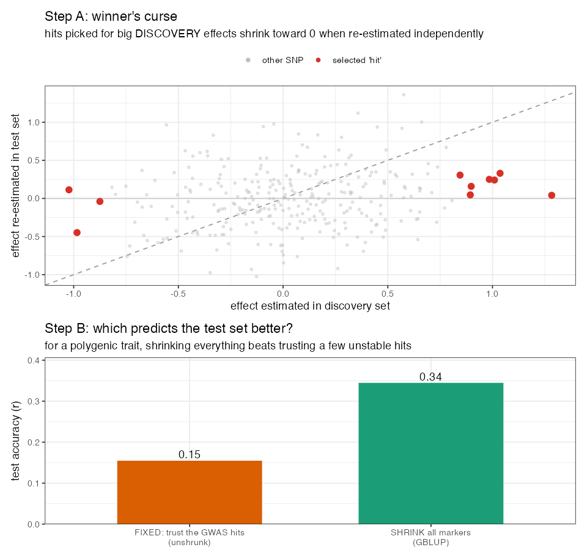

# Lesson 10 — GWAS-assisted Genomic Prediction

> **The question (Objective 3):** GBLUP treats every SNP equally (Lesson 7). But GWAS just told
> us *some* SNPs are specially associated with the trait (Lesson 9). **What if we tell the
> prediction model "these specific SNPs are important"?** Intuitively that should help. The
> surprising, instructive answer: **it didn't — it usually hurt.** Understanding *why* is one
> of the most valuable lessons in the whole study.

---

## 10.1 The idea: promote the GWAS hits to "fixed effects"

In plain GBLUP, all markers are pooled into **G** and shrunk equally (Lesson 7) — they're
**random** effects. GWAS-assisted GP pulls the significant SNPs *out* of that pool and adds them
back as **fixed effects** that are **not shrunk**:

🧮 **The augmented model.**

$$ \mathbf y = \mathbf 1\mu + \underbrace{\mathbf{W}\boldsymbol\beta}_{\text{GWAS hits, FIXED (no shrinkage)}} + \underbrace{\mathbf g}_{\text{rest of genome via } \mathbf G,\ \text{random}} + \mathbf e $$

- $\mathbf W$ — genotypes at just the GWAS-significant SNPs.
- $\boldsymbol\beta$ — their effects, estimated **freely** (fixed = "trust these fully").
- $\mathbf g \sim N(\mathbf 0, \mathbf G^\ast\sigma_g^2)$ — the *remaining* markers (the hits are
  **removed from G** so they're not double-counted) still shrunk as usual.

This is exactly the repo code:
```r
indexQTL <- which(colnames(M) %in% GWAS_res$SNP)   # the significant SNPs
QTL   <- M[, indexQTL]                              # pulled out as fixed effects
M_new <- M[, -indexQTL]                             # removed from the background
G_qtl <- tcrossprod(scale(M_new)) / ncol(M_new)     # G WITHOUT the hits
ETA <- list(list(X = QTL,   model = "FIXED"),       # hits: fixed, unshrunk
            list(K = G_qtl, model = "RKHS"))         # rest: random, shrunk
fm_gwas <- BGLR(y = yNA, ETA = ETA, ...)
```

🧠 **Intuition for "fixed = unshrunk."** A **random** effect is humble: "this marker probably has
a small effect; shrink it toward 0 unless the data insist otherwise." A **fixed** effect is
confident: "this marker matters; estimate its effect at face value, no shrinkage." Promoting a
SNP to fixed says *"I'm sure about you."*

---

## 10.2 Why it *should* help — and why it didn't

**The hope:** if a few loci truly have big effects, estimating them precisely (unshrunk) and
letting G mop up the rest should beat shrinking everything uniformly.

🔬 **What actually happened (paper's Fig. 3 & 4, all traits & years):** adding GWAS SNPs as fixed
effects **reduced** prediction accuracy, across the board. The negative effect was strong enough
that even when combined with helpful multi-trait information, it dragged accuracy down.

**Why? Three reasons, each building on earlier lessons:**

1. **The hits were unstable (Lesson 9).** Only 52/555 associations recurred in ≥20 of 100
   subsets; *none* in all 100. So "the important SNPs" change depending on who's in the training
   set. You're hard-coding **confidence in things that aren't reproducible** → you fit noise.

2. **Yield/appearance are polygenic (Lesson 9).** Their genetic signal is spread over thousands
   of tiny effects. The few detectable SNPs explain a sliver of the variance. Trusting that
   sliver *fully* (fixed) while the true signal lives in the shrunken background is backwards —
   you've promoted the least representative part of the architecture.

3. **Selection bias / "winner's curse."** SNPs are chosen *because* they had extreme
   associations **in the training data**. Extreme-in-training effects are partly luck and
   **regress toward the mean** in new data — so their fixed (unshrunk) estimates are *over*-
   confident and predict the test set worse. Shrinkage exists precisely to defend against this;
   making them fixed *removes the defense.*

🧠 **The deep lesson.** GBLUP's equal shrinkage isn't a crude simplification to be "improved"
with GWAS — for polygenic traits it is **close to optimal**, because it honestly reflects that
*we don't know which markers matter and most matter a little.* GWAS-assisted GP injects false
certainty, and the model pays for it.

⚠️ **Common confusion — "so GWAS is useless for breeding?"** No. GWAS is great for *understanding
genetic architecture* and finding **major-gene** candidates (e.g., a disease-resistance locus
with a big, stable effect). For such **oligogenic** traits, marker-assisted or GWAS-assisted
approaches *can* help. The failure here is specific to **polygenic** traits with **unstable**
hits — exactly yield and canning appearance. Match the tool to the architecture.

---

## 10.2b 🧸 Toy first — *see* the winner's curse (`code/toy_10_winners_curse.R`)

The abstract reasons above become obvious on a toy. Simulate a **polygenic** trait: 300 SNPs, each
with a *tiny* true effect, in 200 lines split into a **discovery** set and a **test** set. Run a
GWAS-style scan on discovery, pick the **top-10 SNPs**, and inspect them.

**Step A — winner's curse.** Plot each SNP's effect *as estimated in discovery* (x) against its
effect *re-estimated independently in the test set* (y). The selected "hits" (red) sit far out on
the x-axis but collapse toward **0** on the y-axis — far below the dashed $y=x$ line:



🔬 The numbers are stark: the top-10 hits average $|{\hat\alpha}| = 0.98$ in discovery, but only
**0.20** when re-estimated honestly — and their *true* average effect is just **0.16**. They looked
big **because they got lucky in the discovery sample** (extreme noise + small real effect). A
**fixed** effect trusts that 0.98 at face value; reality is 0.16.

**Step B — so prediction suffers.** Predict the test set two ways:
- **FIXED:** trust the 10 hits, estimate them unshrunk → test accuracy **0.15**.
- **SHRINK everything (GBLUP):** pull all 300 markers toward 0 → test accuracy **0.34**.

🧠 **That 0.15 vs 0.34 is the paper's "+GWAS hurts" result in miniature.** Shrinkage is a *defense*
against the winner's curse; promoting hits to fixed effects removes the defense and lets the
overconfident estimates mislead the prediction. 🔭 **Zoom out:** the real models did exactly this
with FarmCPU hits that were *also* unstable across the 100 training subsets (§9.6) — so the real
penalty was, if anything, larger.

---

## 10.3 The result table in words

🔬 Summarizing the paper's GWAS-assisted comparisons:
- **GBLUP + GWAS** < **GBLUP** (plain) — fixed hits hurt.
- **KA + GWAS** < **KA** — same story with kernels.
- Even **MT + GWAS** (multi-trait *plus* GWAS hits) underperformed the MT models without GWAS —
  the GWAS penalty offset the multi-trait benefit.

So in every comparison, "+GWAS" was a **down**-arrow. The authors' conclusion: a deeper,
function-aware analysis of loci would be needed before injecting them into GP for these traits.

---

## 10.4 Where this sits in the mental map

This closes Objective 3 with a clear, generalizable principle:

> **More information is not automatically better.** Adding *confident but wrong/unstable*
> information degrades a model. The art is knowing *which* information to trust *how much* —
> which is exactly what shrinkage (random effects) does automatically, and what fixing effects
> overrides.

This same theme returns in Lesson 11 (NIRS also didn't help) and contrasts with Lesson 12
(correlated traits *did* help, because that information was stable and relevant).

---

## 10.5 What you should now be able to say
- **GWAS-assisted GP** promotes significant SNPs to **fixed (unshrunk) effects**, keeping the
  rest in **G**.
- Here it **lowered accuracy for every trait/year** because the hits were **unstable**, the
  traits are **polygenic**, and unshrunk effects suffer **winner's-curse** over-confidence.
- **Equal shrinkage (GBLUP)** is near-optimal for polygenic traits *because* it admits we don't
  know which markers matter — fixing GWAS effects removes that protection.
- GWAS-assisted prediction can still help for **oligogenic** traits with **stable, large-effect**
  loci; match the method to the architecture.

👉 Next: **[Lesson 11 — NIRS & Regularized Selection Indices](11_NIRS_RSI.md)** — a second
"more data" idea (cheap light scans), and whether it paid off.
