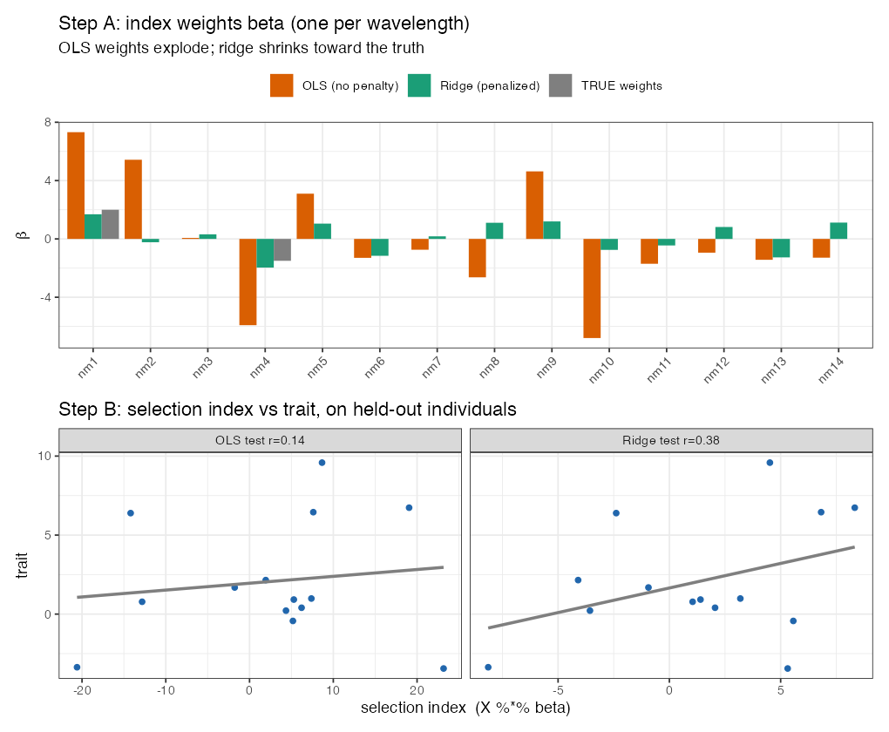

# Lesson 11 — NIRS & Regularized Selection Indices

> **The question (Objective 2):** Canning quality is expensive to measure (Lesson 1). A **NIRS
> scan** is cheap, fast, and non-destructive (Lesson 2). Can we squeeze the 551-wavelength
> spectrum into a single useful number — a **selection index** — that acts as a cheap *secondary
> trait* to help predict the expensive one? Here's the method (penalized regression) and the
> verdict.

---

## 11.1 The raw material: a spectrum per line

Each line has a **near-infrared spectrum**: absorbance at 551 wavelengths (1100–2200 nm). It's an
indirect chemical fingerprint — water, starch, protein, and seed-coat compounds each absorb
differently. Before modeling, the spectra are **preprocessed** with **Standard Normal Variate
(SNV)** normalization (the `prospectr` package), which removes scatter/baseline differences
between samples so curves are comparable.

⚠️ The challenge: **551 predictors, ~272 lines.** Just like the marker matrix, this is
$p > n$ — you cannot fit an ordinary regression of trait on all 551 wavelengths. And many
adjacent wavelengths are nearly identical (highly correlated). We need **variable
selection + shrinkage**.

---

## 11.2 The goal: a Regularized Selection Index (RSI)

We want weights $\boldsymbol\beta$ (one per wavelength) so that the weighted sum of a line's
spectrum predicts its trait:

🧮 **Selection index.**

$$
\text{RSI}_i = \sum_{k=1}^{551} \beta_k \, x_{ik} = \mathbf{x}_i^\top \boldsymbol\beta
$$

— collapse 551 numbers into **one** index per line, tuned to correlate with the target trait
(e.g., canning appearance).

🧠 **Intuition.** A selection index is a *recipe*: "take 0.3 × (this wavelength) − 0.1 × (that
one) + …" to brew a single score that tracks the trait. The art is choosing the recipe weights
without overfitting 551 ingredients to only ~272 samples.

---

## 11.3 Regularization — taming $p > n$ with a penalty

The authors estimate the weights with a **penalized (ridge-type) regression** following
Lopez-Cruz et al. (2020):

🧮

$$
\hat{\boldsymbol\beta} = \big(\mathbf{P}_x + \lambda\mathbf{I}\big)^{-1}\,\mathbf{G}_{x,y}
$$

- $\mathbf{P}_x$ — the variance–covariance matrix of the wavelengths (how spectra co-vary).
- $\mathbf{G}_{x,y}$ — the genetic covariances between each wavelength and the target trait
  (estimated via `getGenCov` — the *genetic* part of the relationship, not just phenotypic).
- $\lambda$ — the **penalty** (the same idea as ridge in Lesson 7 / GBLUP): without it,
  $\mathbf{P}_x$ is not invertible ($p>n$) and the fit overfits; adding $\lambda\mathbf{I}$
  **stabilizes the inverse and shrinks the weights**, performing implicit variable selection.

🧠 **Intuition for $\lambda$.** $\lambda=0$: trust all 551 wavelengths fully → memorize noise →
great on training, useless on new lines. Large $\lambda$: squash all weights → ignore the
spectrum. The sweet spot in between keeps only the *reliably useful* wavelengths.

**How $\lambda$ is chosen — cross-validation (preview of Lesson 13).** The authors do **10-fold
cross-validation** over a grid of 100 $\lambda$ values, picking the $\lambda$ that maximizes the
correlation between the index and the trait *on held-out folds*. This is the repo's inner loop:
```r
for (k in 1:cv) {                       # 10-fold CV inside the training set
  fm  <- getGenCov(y[trt], X[trt,], K = G1[trt,trt])   # genetic covariances
  fm2 <- solveEN(var(X[trt,]), fm$covU, X = X[trt,])    # penalized solve over a λ-grid
  # ... record which λ maximized accuracy on the held-out fold ...
}
lambda0 <- mean(lambda)                  # average best λ across folds
```
(The package `SFSI` provides `solveEN`/`getGenCov`; we describe it rather than run it, since
`SFSI` needs compilation. The *principle* — penalized regression chosen by CV — you already
own from Lesson 7.)

🌱 **Breeding logic.** If this works, a breeder scans seeds in seconds and gets an index that
ranks lines for canning quality — no taste panel, no cooking. Even a *moderately* predictive
index could pre-screen thousands of lines down to a few worth panel-testing.

---

## 11.3b 🧸 Toy first — *why* you must penalize (`code/toy_11_rsi.R`)

Forget 551 wavelengths for a moment. Take **14 toy "wavelengths"** but only **12 training
individuals** (so $p>n$, like the real NIRS problem), where truly only 2 wavelengths matter. Build
the index $\text{RSI}=\sum_k\beta_k x_k$ two ways and test on **held-out** individuals:

**Step A — the weights $\beta_k$.** Plain least-squares (no penalty) vs. a ridge penalty vs. the
truth:
- **OLS weights explode** — huge positive/negative values on *noise* wavelengths (it has too much
  freedom and chases random patterns).
- **Ridge weights are shrunk** toward 0, roughly recovering the 2 real signals.

**Step B — does the index predict held-out individuals?**

| index | accuracy on *training* | accuracy on *held-out test* |
|-------|------------------------|------------------------------|
| **OLS (no penalty)** | **1.00** (perfect!) | **0.14** (useless) |
| **Ridge (penalized)** | 0.94 | **0.38** |



🧠 **The lesson in one line:** OLS *memorized* the training data (r = 1.00) but learned nothing
that transfers (r = 0.14). The **penalty $\lambda$** trades a little training fit for real
generalization — which is the entire point of the **R** in **R**SI. This is the same shrinkage idea
as GBLUP (Lesson 7), now applied to spectra.

🔭 **Zoom out:** the real RSI penalizes **551** wavelengths estimated from ~190 lines, with
$\lambda$ chosen by the 10-fold cross-validation below. Same machinery; more columns.

---

## 11.4 The verdict: it didn't help much here

🔬 **In the data (paper's Fig. 3, Supp. Table 3).** The NIRS-based RSI had **low prediction
accuracy** for the target traits, and including it as a secondary trait in multi-trait models
(Lesson 12) **did not improve** — sometimes slightly worsened — accuracy *within* a cycle.

**Why?** The honest reasons:
- **Intact dry seeds.** They scanned *whole* dry beans; the canning-quality signal may live in
  the cooked/internal state that an external dry-seed scan barely sees. (Other studies got better
  results with ground samples or different preprocessing.)
- **Preprocessing choice.** Only SNV was used; the authors note derivatives or wavelet methods
  might extract more signal.
- **Weak trait correlation.** The index just didn't correlate strongly enough with appearance/
  texture to add information beyond what the genome already provided.

⚠️ This echoes Lesson 10's theme: **a cheap extra data source only helps if it carries
*relevant, non-redundant* signal.** NIRS here was cheap but weak; GWAS hits were confident but
unstable. Neither moved the needle.

---

## 11.5 But the *idea* of a secondary trait is the bridge to multi-trait models

Even though NIRS underwhelmed, it introduces the concept that powers the study's biggest win: a
**secondary trait** that's easier/cheaper to measure can lend predictive strength to a hard
target trait — *if* the two are genetically correlated. NIRS was one candidate secondary trait.
The ones that actually worked were **other measured traits**: seed weight (for yield) and texture
(for appearance). That's Lesson 12.

🧠 **Connecting thread.** RSI (this lesson) and multi-trait models (next) are the same strategy —
*borrow information from a correlated, cheaper variable* — applied to two different sources
(spectra vs. correlated traits). Holding that link makes Lesson 12 click instantly.

---

## 11.6 What you should now be able to say
- A **NIRS spectrum** (551 wavelengths) is preprocessed (**SNV**) and collapsed into a single
  **Regularized Selection Index** $\text{RSI}=\mathbf x^\top\boldsymbol\beta$.
- Because $p>n$ and wavelengths are correlated, weights are found by **penalized regression**
  $(\mathbf P_x+\lambda\mathbf I)^{-1}\mathbf G_{x,y}$, with **$\lambda$ chosen by 10-fold CV** —
  same shrinkage logic as GBLUP.
- Here NIRS-RSI had **low accuracy** and **didn't improve** GP (intact-seed scanning, limited
  preprocessing, weak correlation) — reinforcing that extra data must be *relevant* to help.
- RSI is the conceptual **bridge to multi-trait models**: borrow strength from a correlated,
  cheaper variable.

👉 Next: **[Lesson 12 — Multi-Trait Models](12_multitrait_models.md)** — the strategy that *did*
pay off.
