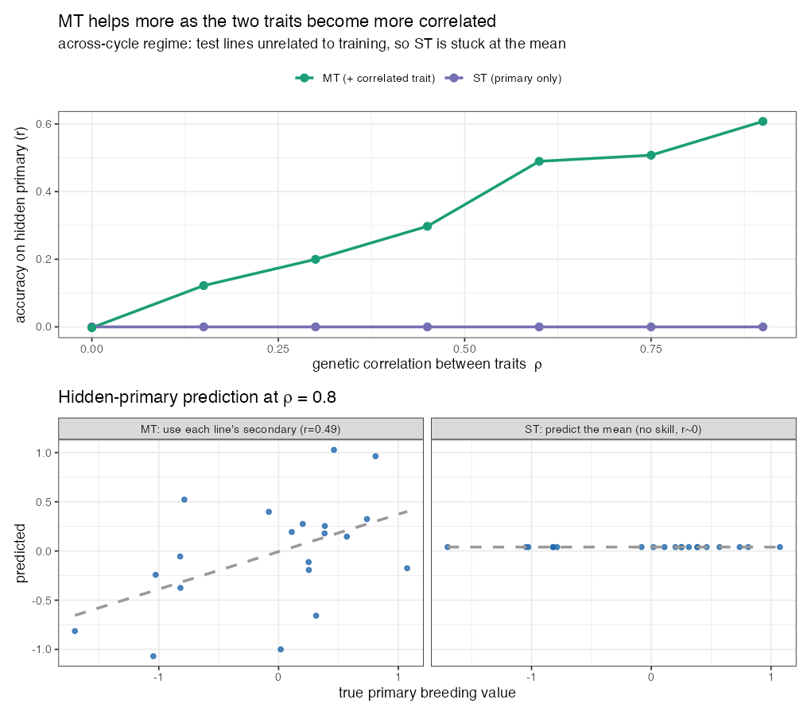

# Lesson 12 — Multi-Trait Models

> **The question (Objective 1):** So far each trait is predicted *alone* (single-trait, ST). But
> traits are **correlated** — yield with seed weight, appearance with texture (Lesson 1). What if
> we predict several traits **jointly**, letting a well-measured correlated trait lend its
> strength to a hard one? This is the **multi-trait (MT)** model — and it delivered the study's
> headline gains.

---

## 12.1 The idea: borrow strength from a correlated trait

Single-trait GBLUP predicts trait 1 using only trait 1's phenotypes + G. A **multi-trait** model
predicts trait 1 *and* a **secondary** trait 2 together, exploiting their **genetic
correlation**: if a line has a high secondary value, and the two traits are genetically linked,
that nudges its predicted primary value.

🧠 **Intuition.** You want to guess a student's *essay* grade (hard to grade, few samples). You
also have their *reading-test* score (easy, plentiful), and the two correlate. A smart predictor
uses the reading score to sharpen the essay estimate — *especially when essay data is thin.* MT
models do exactly this for traits.

🌱 **Breeding logic — pick the *right* secondary trait.** It must be (a) **genetically correlated**
with the target and (b) **cheaper/easier/more heritable** to measure. The authors chose:
- For **yield (YD)** → **seed weight (SW)** as secondary. (Recall yield ↔ SW $r=+0.41$; SW is fast
  and highly heritable.)
- For **appearance (App)** → **texture (Text)** as secondary. (Text is machine-measured, objective,
  high $h^2$.)

Both secondaries are exactly the kind of cheap, heritable, correlated traits the strategy needs.

---

## 12.2 The model

🧮 **Multi-trait GBLUP.** Stack the two traits' phenotypes and model their breeding values as
**correlated**:

$$ \binom{\mathbf y_1}{\mathbf y_2} = \boldsymbol\mu + \binom{\mathbf g_1}{\mathbf g_2} + \mathbf e, \qquad \binom{\mathbf g_1}{\mathbf g_2} \sim N\!\left(\mathbf 0,\ \mathbf{\Sigma}_g \otimes \mathbf G\right) $$

(the $\binom{\cdot}{\cdot}$ here just means the two traits **stacked** into one tall vector.) The new
ingredient is the **genetic covariance matrix between traits**, $\mathbf{\Sigma}_g$:

| $\mathbf{\Sigma}_g$ | trait 1 | trait 2 |
|---|---|---|
| **trait 1** | var(g₁) | cov(g₁,g₂) |
| **trait 2** | cov(g₁,g₂) | var(g₂) |

- $\sigma_{g_{12}}$ — the **genetic covariance** between trait 1 and trait 2. **This is the
  channel through which trait 2 helps trait 1.** If it's 0, MT collapses back to ST (no help).
- $\otimes \mathbf G$ — relatedness still governs *within* each trait (Lesson 6).

In the repo, this is `BGLR::Multitrait`, with the secondary trait carried as a second column
(here the NIRS index `SSI`, or a correlated trait like SW/Text), residuals kept diagonal:
```r
Y_MT <- cbind(yNA, secondary)        # primary (with test set NA) + secondary trait
fm_mt <- Multitrait(y = Y_MT, ETA = list(list(K = G1, model = "RKHS")),
                    resCov = list(type = "DIAG"), nIter = 12000, burnIn = 2000)
pred  <- fm_mt$ETAHat[tst]            # predicted primary for the hidden lines
```

⚠️ **Key trick — the secondary trait is observed on the TEST lines too.** The primary trait is
hidden (`NA`) on the test set, but the *secondary* trait is **known** there (it's cheap to
measure!). That's what lets MT add information: for a test line we don't know its yield, but we
*do* know its seed weight, and the genetic correlation converts that into a better yield guess.

---

## 12.2b 🧸 Toy first — see the secondary trait *rescue* a hidden primary (`code/toy_12_multitrait.R`)

Here is the whole mechanism on data you can picture. Six lines; we measure two traits, but the
**primary is hidden on the test lines** while the **secondary is known everywhere** (because it's
cheap — that's the entire premise):

| line | primary $y_1$ | secondary $y_2$ | role |
|------|---------------|------------------|------|
| L1 | 7.1 | 6.4 | train |
| L2 | −5.0 | −4.1 | train |
| L3 | 4.8 | 5.2 | train |
| **L4** | **? (hidden)** | **2.0** | **test** |
| **L5** | **? (hidden)** | **−6.3** | **test** |

⚠️ **The trick that makes MT work:** the model never sees L4/L5's primary value — but it *does* see
their secondary ($y_2$). If the two traits are genetically correlated, that known $y_2$ leaks
information about the hidden $y_1$.

Now the **across-cycle regime** (the realistic, hard one): the test lines are a **new family,
unrelated to training**. We simulate it and compare:
- **ST (primary only):** with no relatives in training, relatedness has nothing to grab → it can
  only guess the population mean → **accuracy ≈ 0** (a flat line of identical predictions).
- **MT (+ correlated trait):** learns on training how $y_2$ tracks $y_1$, then applies it to each
  test line's *own* measured $y_2$.

**Step A — turn up the genetic correlation $\rho$ and watch MT climb while ST stays flat:**

| $\rho$ (trait correlation) | 0.0 | 0.15 | 0.30 | 0.45 | 0.60 | 0.75 | 0.90 |
|---|---|---|---|---|---|---|---|
| **ST accuracy** | 0 | 0 | 0 | 0 | 0 | 0 | 0 |
| **MT accuracy** | 0.00 | 0.12 | 0.20 | 0.30 | 0.49 | 0.51 | 0.61 |

**Step B — at $\rho = 0.8$:** ST is a flat horizontal cloud (everyone gets the mean); MT lines up
with the truth (r ≈ 0.5).



🧠 **Two lessons fall straight out of this toy:**
1. **MT helps in proportion to $\rho$** — no correlation ($\rho=0$) → no help → MT = ST. This is the
   genetic-covariance channel $\sigma_{g_{12}}$ in the equation above, made visible.
2. **MT helps *most* when relatedness can't** — we deliberately made the test lines unrelated, so
   ST collapsed to the mean and the correlated trait was the *only* lifeline.

🔭 **Zoom out — this *is* the study's headline.** Swap the toy's "unrelated new family" for the
real **143 cycle-2 lines** predicted from cycle 1, and the secondary trait for **seed weight**
(for yield) or **texture** (for appearance): MT beats ST by **+63% / +41%** *across cycles*, but
barely *within* a cycle (where relatives already give ST plenty to work with). The toy and the real
result tell the identical story (Lesson 14).

---

## 12.3 When does MT beat ST? The crucial nuance

This is the subtle, important result — and it follows directly from the theory:

🔬 **In the data (paper's Figs. 3–4):**
- **Within a single breeding cycle:** MT and ST performed **about the same**. No big win.
- **Across breeding cycles** (predict the *new* cycle 2 from cycle 1): **MT clearly beat ST** —
  up to **+63% accuracy for yield** and **+41% for appearance**.

🧠 **Why the difference?** MT helps *most when primary-trait information is scarce*. Within a
cycle, you already have lots of relatives with measured primary trait → G alone predicts well →
little room for a secondary trait to add value. But **across cycles**, the new lines are weakly
related to the training set (Lesson 6's blocks!) → G has little to work with → the secondary
trait, **measured on those very test lines**, becomes a lifeline. The harder the prediction, the
more the correlated trait pays off.

> Formally, the MT advantage grows with (a) the **genetic correlation** between traits and (b)
> the **heritability of the secondary** trait — and it matters most when the **primary** is hard
> to predict (low relatedness, low $h^2$). All three conditions hold in the across-cycle yield/
> appearance case.

🌱 **Breeding payoff.** This is genuinely actionable: when you bring in a brand-new set of lines
(every cycle!), measuring a cheap correlated trait (seed weight, texture) on them and running a
multi-trait model can boost selection accuracy for the expensive target by *tens of percent* —
exactly when you need it most.

---

## 12.4 Why MT helped but NIRS/GWAS didn't — unifying the three "extra info" objectives

| Extra information | Stable? | Relevant (correlated)? | Helped? |
|-------------------|---------|------------------------|---------|
| **GWAS hits** as fixed effects (L10) | ✗ unstable across subsets | weak (polygenic) | **No** (hurt) |
| **NIRS index** as secondary (L11) | ✓ | weak correlation with target | **No** (flat) |
| **Correlated trait** (SW, Text) as secondary (L12) | ✓ | **strong** genetic correlation | **Yes** (big, across cycles) |

🧠 **The grand theme of the paper, in one table.** Adding information helps **only** when it is
both **stable** and **genuinely correlated** with the target. The correlated secondary traits met
both bars; GWAS hits failed on stability; NIRS failed on correlation strength. *This is the single
most transferable idea in the study.*

---

> 🔧 **In practice (R).** Multi-trait GP: **`BGLR::Multitrait`** (the paper), `sommer`'s
> multivariate `mmer` (e.g. `cbind(y1,y2) ~ ...`), the `MTM` package, or `asreml`. These estimate
> the genetic covariance $\sigma_{g_{12}}$ that does the "borrowing." Our `04_across_cycle.R` calls
> `BGLR::Multitrait` for the yield+seed-weight model.

## 12.5 What you should now be able to say
- **Multi-trait (MT)** models predict several traits jointly, using the **genetic covariance**
  $\sigma_{g_{12}}$ to let a **correlated secondary trait** (measured even on the test lines)
  improve the primary prediction.
- MT $\approx$ ST **within** a cycle, but MT **>> ST across** cycles (+63% yield, +41% appearance)
  — because correlated traits help **most when the primary is hard to predict**.
- The MT benefit grows with **trait correlation** and **secondary heritability**.
- MT worked where GWAS/NIRS didn't because its extra information was both **stable and strongly
  correlated** — the study's central principle.

👉 Next: **[Lesson 13 — Cross-Validation & Prediction Accuracy](13_cross_validation_accuracy.md)**
— how all these accuracies were *honestly* measured.
