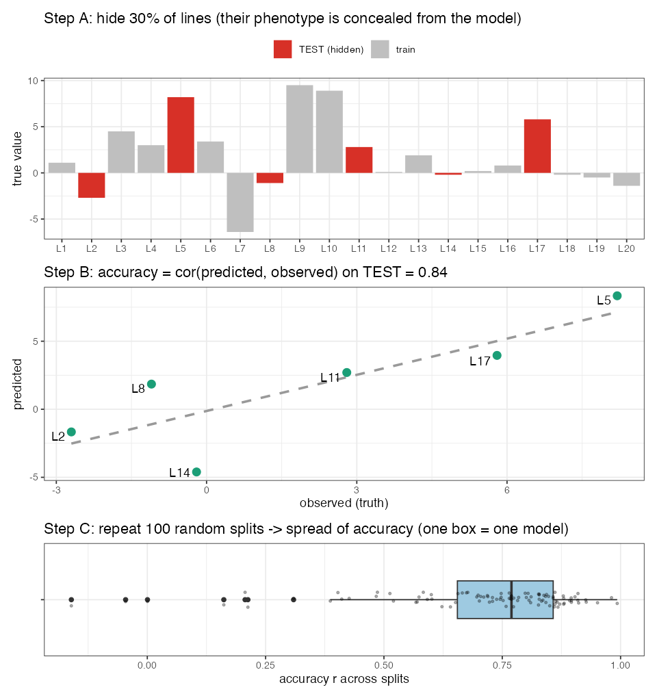

# Lesson 13 — Cross-Validation & Prediction Accuracy

> **The question:** We keep quoting "accuracy 0.64", "+63%". **How do you measure whether a
> prediction model is any good — honestly?** Get this wrong and you'll fool yourself into
> shipping a useless model. This lesson is the scientific backbone that makes every number in the
> paper trustworthy.

---

## 13.1 The cardinal rule: never test on what you trained on

🧠 **Intuition.** If I let you *study the exam answers*, then test you on those exact questions,
your 100% means nothing. A model that has *seen* a line's phenotype can "predict" it
trivially — that's **memorization**, not prediction. To measure real predictive skill, you must
test on lines the model **never saw the phenotype for.**

This is why every accuracy in the study comes from a **train/test split**: hide some lines'
phenotypes, predict them from the rest, then compare predictions to the hidden truth.

---

## 13.2 The split the authors used: 70/30, repeated 100×

🔬 From the methods (and our `code/02`): partition the lines into **70% training / 30% testing**.
Fit the model on the 70%, predict the 30%, score it. Then — crucially — **repeat 100 times** with
different random splits.

🧮 **The split in code:**
```r
n   <- length(y)
tst <- sample(1:n, 0.3 * n)     # 30% hidden test set
trn <- setdiff(1:n, tst)        # 70% training set
yNA <- y; yNA[tst] <- NA        # hide test phenotypes from the model
```

🧠 **Why repeat 100 times?** One split is luck — you might happen to hide easy lines. Repeating
with 100 random splits gives a **distribution** of accuracies, so we can report a *typical* value
and its spread. That's exactly what the **boxplots** in the paper's Figs. 2–4 show: each box = 100
partitions. A method is "better" only if its box sits reliably higher, not by one lucky split.

⚠️ **Common confusion — train/test split vs. the inner 10-fold CV.** Two *nested* loops:
- **Outer:** 70/30 split, ×100 → measures **prediction accuracy** (the headline number).
- **Inner:** within the training set, 10-fold CV → **tunes** things like the RSI penalty $\lambda$
  (Lesson 11). Tuning must happen *inside* training only, never peeking at the test set.

Keeping these separate is what makes the evaluation honest.

---

## 13.3 What "accuracy" actually is

🧮 **Prediction accuracy** in this study =

$$ r = \text{cor}\big(\hat y_{\text{test}},\ y_{\text{test}}\big) $$

the **Pearson correlation** between predicted and observed values on the held-out lines.

- $r=1$: perfect ranking. $r=0$: useless. $r\approx0.6$: moderate — good enough to **select**.
- We care about *ranking*, not exact values: a breeder keeps the top X% of lines, so a model that
  gets the **order** right is valuable even if absolute predictions are off.

🌱 **Breeding logic.** Selection accuracy $r$ is the very $r$ in the breeder's equation
$\Delta G = i r \sigma_A$ (Lesson 5). So "prediction accuracy" isn't an abstract score — it
**directly scales genetic gain**. A jump from $r=0.4$ to $r=0.65$ is a ~60% boost in gain per
cycle, all else equal. That's why the paper's "+63% for yield" is a big deal.

⚠️ **Accuracy is capped by heritability.** You can only predict the genetic part; recall
high-$h^2$ color → $r\approx0.93$, low-$h^2$ yield → $r\approx0.6$. A low number isn't always a
bad model — sometimes the trait just has a low ceiling.

---

## 13.3b 🧸 Toy first — measure accuracy with your own eyes (`code/toy_13_cv.R`)

Take **20 lines** with known true values and a model's predictions (correlated with truth, not
perfect). Now do exactly what the study does:

**Step A — hide 30%.** Randomly pick 6 lines as the **test set** and conceal their phenotypes from
the model.

**Step B — predict the hidden lines, then correlate.** Plot predicted vs. observed for *only* those
6 hidden lines; the **accuracy is that correlation** — here **r = 0.84**.

**Step C — don't trust one split.** Repeat the random 70/30 split **100 times**: you get a *spread*
of accuracies (mean ≈ 0.71, ranging from −0.16 to 0.99!).



🧠 **Why Step C matters.** A single split can be lucky (r = 0.99) or unlucky (r negative!). That's
why the paper reports a **boxplot of 100 splits**, not one number — and why a model is only "better"
if its *whole box* sits higher. 🔭 **Zoom out:** swap 20 toy lines for **272** real ones, the
hidden 6 for **~82**, and read every boxplot in the paper's Figs. 2–4 as "this Step-C distribution,
for one model."

---

## 13.4 Table 1 decoded — the menu of train/test designs

The paper's **Table 1** lists the models and *what each was trained vs. validated on*. Decoded:

| Model | Trained on | Idea (lesson) |
|-------|-----------|---------------|
| **RSI** | the NIRS index alone | spectra-only baseline (L11) |
| **ST** | Trait 1 only | single-trait GBLUP/KA (L7–8) |
| **ST-G** | Trait 1 + GWAS hits | GWAS-assisted single-trait (L10) |
| **MT-C** | Trait 1 + a correlated trait | multi-trait, correlated secondary (L12) |
| **MT-R** | Trait 1 + RSI | multi-trait, NIRS secondary (L11–12) |
| **MT-GC** | Trait 1 + correlated trait + GWAS | multi-trait + correlated + GWAS |
| **MT-GR** | Trait 1 + RSI + GWAS | multi-trait + NIRS + GWAS |

The letters are a code: **G** = GWAS, **C** = Correlated trait, **R** = RSI (NIRS). So **MT-GC** =
"Multi-Trait with GWAS and Correlated trait." Reading Figs. 3–4 is now just decoding which
boxplot is which letter combo — and asking *"did the extra letter raise the box?"* (Mostly: **C**
helped across cycles; **G** and **R** didn't.)

---

## 13.5 Two evaluation scenarios — within vs. across cycle

The study evaluates accuracy under **two regimes**, and they answer different breeder questions:

1. **Within breeding cycle 1** (272 lines, 70/30 random split): *"If I have a panel and measure
   most of it, how well do I predict the rest?"* → the Lesson 2.1/13.2 setup. Both ST and MT do
   well; KA slightly beats GBLUP.
2. **Across breeding cycles** (train on cycle 1, predict cycle 2): *"How well do last cycle's data
   predict next cycle's brand-new lines?"* → harder, and where MT shines. This is **Lesson 14**.

🧠 The within-cycle scenario is the *optimistic* one (test lines have relatives in training); the
across-cycle scenario is the *realistic deployment* one (you're always predicting new material).
Reporting both is what makes the study honest about real-world performance.

---

## 13.6 Pitfalls this design avoids (and you should too)

- **Data leakage:** tuning on the test set. Avoided by the nested inner CV (§13.2).
- **Lucky-split optimism:** avoided by 100 repetitions + boxplots.
- **Relatedness leakage:** within-cycle accuracy is inflated by close relatives in train/test;
  the authors *expose* this by also doing the harder across-cycle test rather than hiding behind
  the rosy within-cycle numbers.
- **Confusing fit with prediction:** they never report training-set correlation as "accuracy."

---

> 🔧 **In practice (R).** The split-and-score loop is plain base R (`sample()` to make folds,
> `cor()` to score) — that's all `01`–`07` in `code/` use. For ready-made cross-validation
> wrappers there are `rsample`/`caret` (generic) and GP-specific tools like `BWGS` and the helpers
> in `BGLR`/`sommer`.

## 13.7 What you should now be able to say
- Honest evaluation **hides test phenotypes** and scores predictions on them; the study uses
  **70/30 splits repeated 100×** (boxplots) for the headline accuracy, with an **inner 10-fold
  CV** only for tuning.
- **Accuracy = Pearson $r$** between predicted and observed test values; it **scales genetic gain**
  ($\Delta G=i r \sigma_A$) and is **capped by heritability**.
- **Table 1**'s model codes (**G**=GWAS, **C**=correlated, **R**=RSI; ST/MT) are just train-set
  recipes; reading the figures = decoding the letters.
- Two regimes — **within** vs. **across** cycle — answer different questions; reporting both keeps
  the study honest.

👉 Next: **[Lesson 14 — Across Breeding Cycles & Updating](14_across_cycles_updating.md)** — the
realistic test, and the practical rule it yields.
