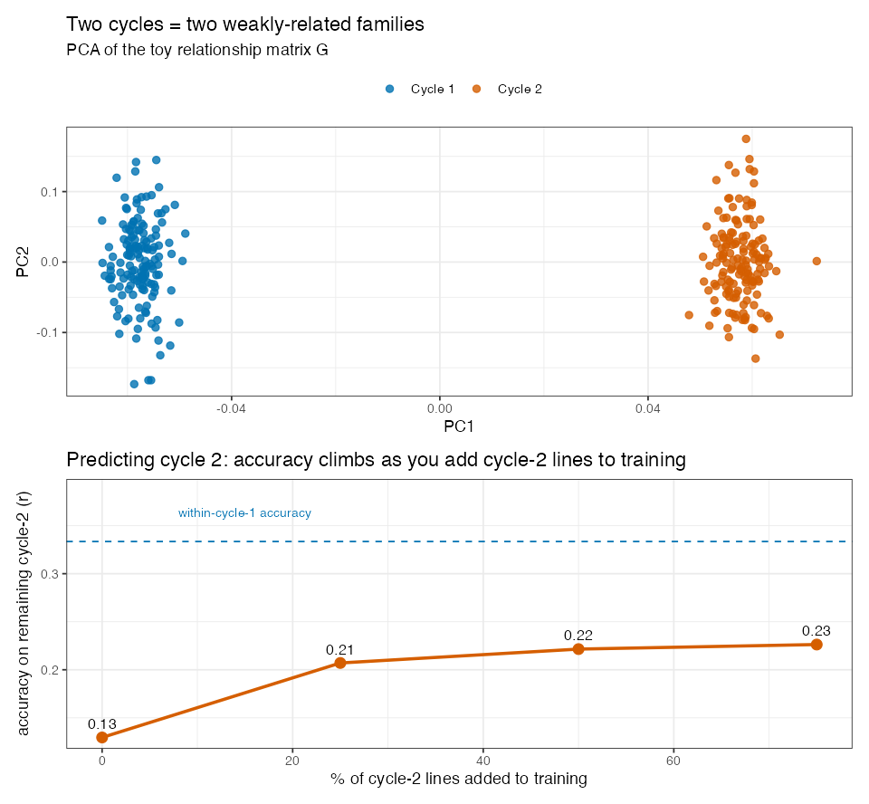

# Lesson 14 — Across Breeding Cycles & Updating the Training Set

> **The question (Objective 4):** In real breeding you don't predict the panel you already
> measured — you predict **next cycle's brand-new lines**. How well does that work, and **how
> much new-cycle data must you add to the training set** to keep predictions sharp? This is the
> most *operational* lesson: it tells a breeder what to actually do each year.

---

## 14.1 The realistic test: train on the past, predict the future

Recall the cycle structure (Lesson 1): **cycle 1 = 272 lines** (the "past", measured 2018–19),
**cycle 2 = 143 lines** (the "new" material, 2019). The deployment question is:

> Train a model on cycle 1. Predict cycle 2. How good is it?

🧠 **Why this is *harder* than within-cycle prediction.** From Lesson 6, lines cluster into
program/cycle **blocks**, and relatedness is **higher within a cycle than between cycles**. GBLUP
predicts a test line by leaning on its *relatives* in the training set (Lesson 7). But cycle-2
lines have **few close relatives** in cycle 1 → the bridge $\mathbf G_{\text{test,train}}$ is
weak → accuracy drops. This isn't a flaw in the method; it's the geometry of the data.

🔬 **In the data.** The paper reports accuracy **dropped drastically** when cycle 1 alone (272
lines) was used to predict cycle 2 (143 lines) — for *all* traits. The genetic gap between cycles
is the cause.

---

## 14.2 The fix: keep refreshing the training set

The authors then **add a growing fraction of cycle-2 lines into the training set** (0%, 10%, 20%,
30%, 40%, 50% — i.e. 0, 14, 29, 43, 57, 72 lines) and re-measure accuracy on the remaining cycle-2
lines. The result is the study's clearest practical message:

> **As more new-cycle lines are added to training, prediction accuracy on the rest of the new
> cycle rises steadily.**

🔬 **Reproduced here** (`code/04_across_cycle.R`, yield 2019; 20 reps per point):

| % of cycle-2 lines added to training | ST accuracy | MT accuracy (yield + seed wt) |
|---|---|---|
| 0% (predict cycle 2 purely from cycle 1) | 0.25 | 0.31 |
| 10% | 0.31 | 0.36 |
| 20% | 0.33 | 0.38 |
| 30% | 0.37 | 0.42 |
| 40% | 0.38 | 0.44 |

> See `figures/07_across_cycle.png`. **Two effects are visible at once, both predicted by the
> theory:** (1) accuracy **climbs steadily** as more cycle-2 lines join training (Objective 4),
> and (2) the **MT curve sits above ST** at every point (Objective 1). At 0% added — the hardest,
> "pure future" case — ST is only ~0.25; adding a correlated trait (MT) lifts it ~22%, and adding
> real new-cycle data lifts it further still. The paper, with 100 reps and full MCMC, saw yield
> accuracy increase up to **1.8-fold** and texture up to **0.6-fold** by 50%, and MT gains up to
> **+63%** — our lighter laptop run reproduces the same *directions and shape.*

🧠 **Intuition.** Each new-cycle line you measure and add to training gives the model *relatives*
of the lines you still want to predict — strengthening $\mathbf G_{\text{test,train}}$. You're
literally building the bridge across the cycle gap, plank by plank.

🌱 **Breeding logic — the operational rule.** A genomic-prediction model is **not** "train once,
use forever." It **decays** as your germplasm moves away from the training set. Every cycle you
must **fold a sample of the new lines (with measured phenotypes) back into training** to keep
accuracy up. Budget for it: phenotype a slice of each new cycle precisely so the model keeps
working on the rest.

---

## 14.2b 🧸 Toy first — build the rising curve yourself (`code/toy_14_across_cycle.R`)

Let's manufacture the two-cycle problem in miniature. Simulate **two genetic clusters** — "Cycle
1" and "Cycle 2" — with *independent* allele frequencies, so they're **weakly related** (just like
real cycles, Lesson 6). A PCA of the toy **G** shows them as two clearly separated clouds:

Now train GBLUP on Cycle 1 and predict Cycle 2, adding more Cycle-2 lines to training each time:

| % of Cycle-2 lines in training | 0% | 25% | 50% | 75% | (within-Cycle-1 reference) |
|---|---|---|---|---|---|
| accuracy on remaining Cycle 2 | **0.13** | 0.21 | 0.22 | **0.23** | **0.33** |

🧠 **Read the curve.** At **0%** (predict Cycle 2 purely from Cycle 1) accuracy is a feeble **0.13**
— because the test lines have *no relatives* in training (look at the PCA gap; $\mathbf
G_{\text{test,train}}\approx 0$). Each batch of Cycle-2 lines you add gives the remaining Cycle-2
lines *relatives* in the training set, and accuracy **climbs toward** the within-Cycle-1 ceiling
(dashed line, 0.33) — but never quite reaches it on this budget.

🔭 **Zoom out — this is exactly `figures/07_across_cycle.png` on the real data:** real yield-2019
accuracy started ~0.25 predicting cycle 2 from cycle 1 and rose steadily as cycle-2 lines were
added. The toy isolates *why*: **relatedness, rebuilt plank by plank.**

---

## 14.3 Multi-trait shines exactly here

This is where Lessons 12 and 14 join hands. Across cycles — where ST prediction struggles — the
**multi-trait** model's correlated secondary trait (seed weight for yield, texture for appearance)
adds the most value, because:
- The **primary** trait is hard to predict (weak cross-cycle relatedness).
- The **secondary** trait is **measured on the new-cycle test lines themselves** (it's cheap!),
  injecting fresh, line-specific information that G can't supply.

🔬 So the headline gains — **+63% accuracy for yield, +41% for appearance** — are *across-cycle*
gains. Within a cycle, MT ≈ ST (Lesson 12); across cycles, MT pulls clearly ahead. Our
reproduction shows the MT curve sitting above the ST curve at low percentages, then both
converging as enough new-cycle data makes the problem easy for either model.

🧠 **Putting it together:** MT and "updating the training set" are **two complementary remedies**
for the same disease (cross-cycle accuracy decay). MT helps *immediately* using a cheap correlated
trait; updating helps *over time* by rebuilding relatedness. A smart program uses **both**.

---

## 14.4 Why not just always use a huge old training set?

Because relatedness, not raw size, drives accuracy. A bigger training set of *distantly related*
old lines helps far less than a *smaller, fresher* set related to your targets. (The paper notes a
larger study with 3,722 lines saw bigger update gains than this 415-line one — size helps too —
but the *relatedness* principle dominates.) The lesson: **invest phenotyping in material related
to what you're about to select**, not just in accumulating history.

---

## 14.5 The mental-map payoff

Lesson 14 closes the loop back to Lesson 0's flowchart. Everything funnels here:
- Clean phenotypes (L3) and quality markers (L4) →
- relatedness **G** (L6) that has **block structure** (the root cause of cross-cycle decay) →
- prediction models (L7–8) whose accuracy depends on that relatedness →
- remedies: **multi-trait** (L12) and **training-set updating** (this lesson).

The research question from Lesson 0 — *"can we predict bean quality/yield from DNA well enough to
select?"* — gets a nuanced **yes**: within related material, accuracies of 0.6–0.93 are plenty for
selection; across new material, you must **add correlated traits and refresh the training set** to
keep that power.

---

## 14.6 What you should now be able to say
- Predicting a **new breeding cycle** is **harder** than within-cycle prediction because new lines
  are **weakly related** to the training set (G's block structure, Lesson 6) — accuracy drops.
- **Adding a growing fraction of new-cycle lines to training steadily restores accuracy** (up to
  ~1.8-fold for yield by 50%); genomic-prediction training sets must be **continually updated**.
- **Multi-trait models help most across cycles** (+63% yield, +41% appearance) because the cheap
  correlated trait is measured on the very lines being predicted.
- **Relatedness, not just size**, drives accuracy — phenotype material *related to your selection
  targets*.

👉 Next: **[Lesson 15 — Results & Take-home Messages](15_results_and_takehome.md)** — the whole
study in one page.
